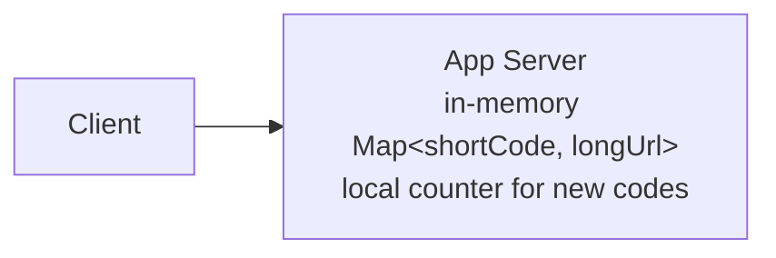
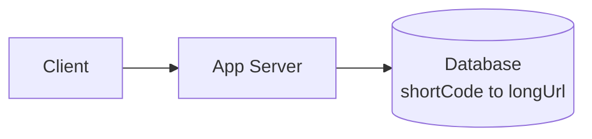
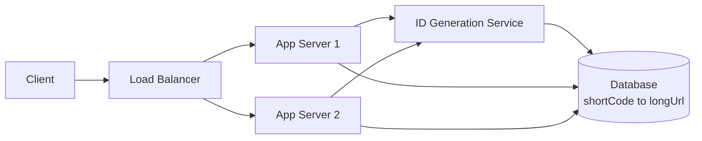
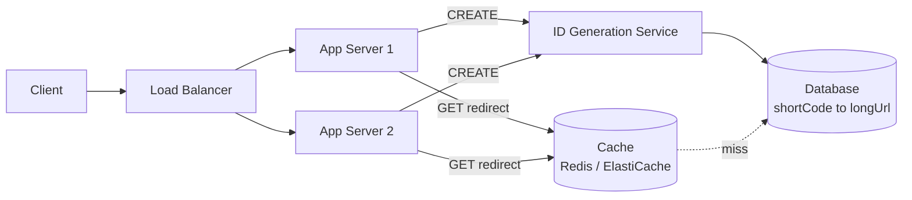
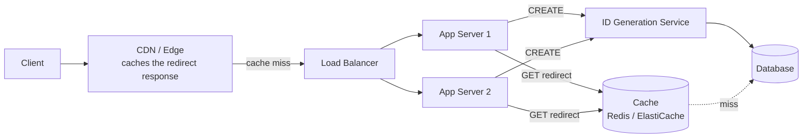
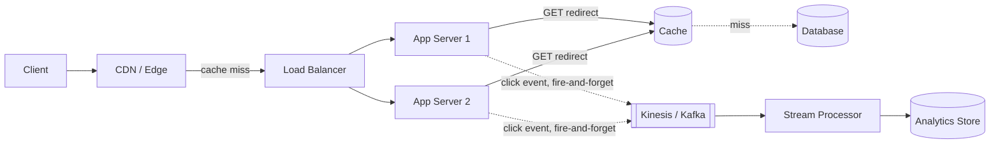
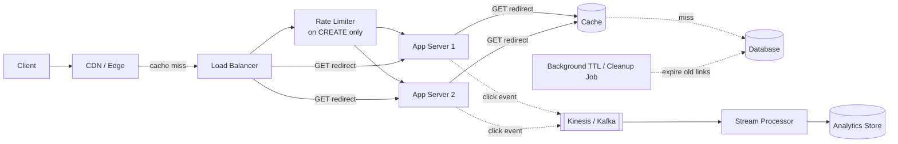

# URL Shortener (TinyURL) — HLD

The **#1 most-reported** Amazon system design prompt (2025–2026 data). It looks like
a "beginner" problem on the surface — map a long URL to a short one — which is
exactly why interviewers use it to separate candidates: anyone can draw the happy
path, but Amazon interviewers reportedly push hard specifically on the
**redirect-scale and analytics follow-ups**, not the basic mapping. The core insight
that should drive almost every decision in this design: redirects vastly outnumber
creates, so this is an overwhelmingly **read-heavy** system.

---

## Q&A: Functional Requirements

**Q: What must the system do?**

- Given a long URL, generate a short, unique code (e.g. `https://amzn.to/abc123`)
  that redirects to the original.
- Support an optional **custom alias** chosen by the creator (e.g. `amzn.to/my-sale`).
- Support an optional **expiration** for a link.
- **Redirect** a short link to its original URL — this is the hot, latency-critical
  path.
- Track **click analytics** per link: count, timestamp, referrer, geo.

---

## Q&A: Non-Functional Requirements

**Q: What quality attributes actually matter here?**

- **Redirect latency must be extremely low.** Redirects vastly outnumber creates —
  often a **100:1+ read:write ratio** — so redirect speed is the dominant traffic
  pattern and dominates the whole design.
- **High availability for redirects.** A broken short link breaks the experience
  everywhere it was shared — marketing campaigns, social posts, print ads. Downtime
  on the write path is annoying; downtime on the redirect path is a public outage.
- **Uniqueness.** No two different long URLs should ever collide onto the same short
  code being served to the wrong target.
- **Scalability.** Billions of URLs stored, tens of thousands of redirects/sec at
  peak.
- **Unpredictability is a nice-to-have, not a hard requirement**, unless the
  interviewer states otherwise. Short codes don't need to be a strict security
  boundary — this is not a secrets-management system.

---

## Q&A: Core Entities

| Entity | Meaning |
|---|---|
| `UrlMapping` | `{ shortCode, longUrl, createdBy, createdAt, expiresAt }` |
| `ClickEvent` | `{ shortCode, timestamp, referrer, geo, userAgent }` — written async, for analytics |

---

## Q&A: API Design

```http
POST /v1/urls
Content-Type: application/json
```

Request:
```json
{ "longUrl": "https://example.com/some/very/long/path", "customAlias": "my-sale", "expiresAt": "2026-12-31T00:00:00Z" }
```

Response:
```json
{ "shortCode": "abc123", "shortUrl": "https://amzn.to/abc123" }
```

Redirect (the hot path):
```http
GET /{shortCode}
```
→ `301` or `302` redirect to `longUrl` (see Step 5 below for which, and why it matters).

Analytics:
```http
GET /v1/urls/{shortCode}/stats
```
```json
{ "shortCode": "abc123", "clicks": 48213, "byReferrer": {"twitter.com": 12000}, "byGeo": {"US": 30000} }
```

---

## HLD Walkthrough — Built Incrementally

Each step below deliberately starts too simple, gets challenged, and grows the
**same** diagram by exactly one new capability. This is how you should actually talk
through it out loud in the interview.

### Step 1 — Naive single-server



**Q: What's wrong with this?**

Three problems at once: it's **not durable** — a restart wipes every mapping ever
created. It's a **single server** — no horizontal scale, and a single point of
failure. And the ID counter is **local to the process** — the moment there's more
than one server, two servers can both hand out counter value `42`, and now two
different long URLs collide onto the same short code.

### Step 2 — Persist to a real store



**Q: What does this fix?**

Durability — mappings now survive a restart. Notice the access pattern here:
`shortCode → longUrl` is exactly a **key-value store** lookup, nothing more exotic.
Rather than re-deriving partitioning, replication, and consistency from scratch,
this system just *is* a key-value store's client — see
[`../../HLD/Key_Value_Store.md`](../../HLD/Key_Value_Store.md) in this repo for the deeper
mechanics (consistent hashing, replication factor, quorum reads/writes, the hot-key
problem) and reference it rather than re-explaining it here.

**Q: What's wrong now?**

Two things. First, a single app server is still a throughput and availability
ceiling — nothing to do but add more of them. Second, and more subtly: the instant
more app servers are added to fix that, the **local incrementing counter breaks all
over again** — two servers can both mint counter value `42` locally, causing a real
collision between two unrelated long URLs.

### Step 3 — Fix distributed ID generation



**Q: How do you generate a unique short code across a fleet of app servers without a
coordination bottleneck on every single request?**

Three real options, each with a real trade-off:

1. **Centralized counter / range allocator.** A small service hands out *batches* of
   IDs — e.g., app server 1 requests a range and gets `[1000, 1999]`, hands those out
   locally with a simple local increment, and only goes back to the allocator once
   the range is exhausted. This cuts coordination overhead from "one atomic
   operation per request" down to "one atomic operation per thousand requests" —
   drastically less contention than a single global `INCR`.
2. **Hash the long URL** (MD5/SHA), truncate it, base62-encode the result. No
   coordination needed at all — any server can compute this independently. The catch:
   truncated hashes can collide, so this needs a check-and-retry — read to see if the
   code is taken, and if so, append a salt and rehash.
3. **Snowflake-style distributed ID**: `{timestamp}{machine-id}{sequence}`, then
   base62-encode the whole thing. No coordination, globally unique by construction
   (each machine owns its own ID space), and roughly time-ordered as a bonus — useful
   for things like sorting or debugging by creation time.

The range-allocator is the most common practical answer — it's simple, fast, and
keeps IDs short since they're still sequential-ish. Snowflake is the answer when
there's no acceptable single point of coordination at all (true multi-region,
multi-datacenter minting). Hash + retry is the answer when you'd rather avoid running
any extra ID-generation infrastructure and are fine with an occasional collision
check on write.

```text
BASE62 = "0123456789ABCDEFGHIJKLMNOPQRSTUVWXYZabcdefghijklmnopqrstuvwxyz"

function encode(id):
    if id == 0: return BASE62[0]
    code = ""
    while id > 0:
        code = BASE62[id % 62] + code
        id = id // 62
    return code
```

### Step 4 — Cache the hot redirect path



**Q: Why does caching matter so disproportionately here, compared to a typical CRUD
service?**

Because of the read:write ratio stated up front — redirects vastly outnumber
creates, often by 100:1 or more. A cache in front of the `shortCode → longUrl`
lookup means the overwhelming majority of all traffic in the entire system — every
redirect — never touches the database at all. This is the single highest-leverage
change available: optimizing the rare `CREATE` path barely matters; optimizing the
frequent `GET` path is almost the whole design from here on.

### Step 5 — Push the redirect to the edge



**Q: A short link's target rarely changes once created — can the redirect itself be
cached even closer to the client?**

Yes — put a CDN/edge layer (e.g., CloudFront) in front of everything, caching the
redirect response so repeat and geographically distributed traffic never even reaches
the origin.

**Q: 301 vs. 302 redirect — which do you use, and why does it matter so much for this
specific problem?**

This is the gotcha interviewers are fishing for, precisely because analytics is a
stated requirement:

- **301 (Permanent Redirect)** tells browsers and CDNs "cache this aggressively, you
  never need to ask again." Fastest possible experience on repeat visits — but the
  server then loses visibility into every subsequent click, since the browser just
  navigates straight to the long URL from its own cache next time. It also makes it
  hard to retarget a link later.
- **302 (Found / Temporary Redirect)** forces every single visit back through the
  server, giving complete click analytics — count, referrer, geo, timestamp, every
  time — at the direct cost of losing the aggressive client-side caching win.

**Most real URL shorteners use 302, specifically because click analytics is a stated
requirement.** State this trade-off explicitly and unprompted — it signals you
understand that a "just use 301, it's faster" answer quietly breaks a functional
requirement.

### Step 6 — Decouple analytics from the hot path



**Q: Where does the click-analytics write happen, given the redirect response needs
to go out as fast as possible?**

Never synchronously on the redirect path. Each redirect fires an event
(`shortCode`, `timestamp`, `referrer`, `geo`, `userAgent`) at a stream — Kinesis or
Kafka — and returns the redirect immediately without waiting for that write to be
acknowledged. A separate stream processor consumes the events asynchronously and
aggregates them into an analytics store. This fully decouples analytics durability
from redirect latency: a slow or backed-up analytics pipeline can never make a
redirect slower.

### Step 7 — Abuse prevention & lifecycle



**Q: What stops someone from spamming the create endpoint, or fighting over the same
custom alias?**

- **Rate-limit the `CREATE` endpoint per user/API key.** This is a fully solved
  problem elsewhere in this prep set — see
  [`02_Rate_Limiter.md`](02_Rate_Limiter.md) in this same folder for the full design
  rather than re-deriving token buckets here.
- **Custom-alias collisions** get rejected at write time via a conditional write
  (`INSERT ... IF NOT EXISTS` / a DynamoDB conditional put) — first writer wins, the
  second gets a `409 Conflict` and can pick another alias.
- **Expiration** is handled by a background cleanup job, or — better, if the store
  supports it — a database-native TTL feature (e.g., DynamoDB TTL) that removes
  expired rows without a dedicated sweep job.

---

## Deep Dives (Q&A)

**Q: How do you guarantee a redirect lookup is fast at billions of rows — you're not
scanning the table on every request, right?**

Correct — a scan would be an O(N) operation and would collapse the instant the table
crossed a few million rows, let alone billions. Redirect speed at this scale comes
from three independent layers stacking on top of each other, each of which turns the
lookup into O(1) or O(log N), never O(N):

1. **The data model is a keyed point lookup by construction, not a scan.**
   `shortCode` is the *partition/primary key* of the store chosen in Step 2 — a
   DynamoDB `GetItem` on partition key resolves via a hash index in O(1), or (for the
   relational alternative) a B-tree index on `shortCode` resolves in O(log N) —
   either way, directly to the one row, regardless of how many other rows exist. This
   is why "what's the access pattern" gets asked before "which database": the mapping
   problem is a keyed lookup by design, so the only real database decision is which
   index backs that key, never a query that has to inspect unrelated rows. Contrast
   this explicitly with a *different* access pattern like "list all URLs created by
   this user" — that needs a secondary index (e.g. a DynamoDB GSI on `createdBy`),
   because it's not a lookup by primary key anymore; the redirect path itself never
   needs one.
2. **Partitioning routes straight to the one node that owns the key.** At billions of
   rows the table is sharded via consistent hashing (see
   [`../../HLD/Key_Value_Store.md`](../../HLD/Key_Value_Store.md)) — a coordinator
   computes `hash(shortCode)` and routes directly to the single partition responsible
   for it. The request never "searches" across nodes. Growing from 1M to 1B rows adds
   more partitions to spread load across, not more work per individual lookup — total
   data size and per-request latency are decoupled.
3. **Caching removes the database from the path almost entirely.** Steps 4–5 already
   layer an app-tier cache (Redis/ElastiCache) in front of the DB, then a CDN/edge
   cache in front of that. Given the stated 100:1+ read:write ratio, the large
   majority of redirects are served straight from RAM at the edge or in the cache tier
   and never reach the partitioned lookup at all. Layer 3 is what makes "fast" the
   common case; layers 1–2 are what bound the worst case — a full cache miss — to
   O(1)/O(log N) instead of degrading as the dataset grows.

The punchline to state explicitly if pushed: *"redirect latency doesn't grow with
total URL count, because every layer — edge cache, app cache, and the underlying
store's index/partitioning — resolves one specific key directly instead of searching.
Table size only matters for things like backups or analytics jobs, never for the
redirect read path."*

**Q: Why base62 encoding instead of a raw decimal counter or a UUID?**

Base62 (`0-9A-Za-z`) packs more information per character than decimal, so the same
ID space needs a much shorter string — 7 base62 characters covers `62^7 ≈ 3.5
trillion` distinct codes, versus needing 13 decimal digits for the same range. It's
also naturally URL-safe, unlike base64, which introduces `+` and `/` that need
escaping in a URL path.

**Q: How do you handle collisions in the hash-based ID approach?**

Read-before-write: after computing the truncated hash, check if that code is already
taken. If it is, append a counter or random salt to the input and rehash, then retry
the write. This trades a small amount of extra latency on create (an operation that's
rare) to keep the redirect path collision-free (an operation that's frequent).

**Q: How do you guarantee global uniqueness across data centers without a bottleneck
coordinator?**

Expanding on Step 3: a single centralized range allocator is fine within one region,
but becomes a cross-region bottleneck (or SPOF) at true global scale. Two ways
around it: give each region/data-center its own reserved slice of the ID space up
front (e.g., a machine-id or region-id prefix baked into the code) so no cross-region
coordination is ever needed, or go full Snowflake — timestamp + machine-id +
sequence — which is uniqueness-by-construction with zero runtime coordination at
all. The trade-off versus a single global counter is losing strict sequential
ordering in exchange for that independence.

**Q: How do you handle a "hot"/viral short link getting a disproportionate share of
traffic — a link that gets tweeted by someone huge and suddenly takes 5% of all
redirect traffic?**

This is exactly the **Hot Key Problem** already documented in
[`../../HLD/Key_Value_Store.md`](../../HLD/Key_Value_Store.md#1-hot-key-problem) — one key
overwhelming a single partition or cache node regardless of overall cluster size.
The multi-layer caching already built in Steps 4–5 (app-tier cache, then edge/CDN
cache) is most of the mitigation for free, since a viral link is by definition the
*best possible case* for a cache — extremely high hit rate. If it's still hot enough
to overload a single cache node, the same techniques apply here as in the key-value
store note: replica reads fanned across multiple cache nodes, or key splitting for
the click-counter specifically (shard the counter, aggregate on read).

**Q: How do you validate or reserve a custom alias?**

Check length/character constraints, run it against a reserved-word and profanity
list, then attempt the conditional write described in Step 7 — the write itself is
the authoritative uniqueness check, since checking availability and then writing
separately is a race condition (two users could both pass a "is it free?" check for
the same alias a moment apart).

---

## Common Questions Asked

**Q: Why base62 and not base64?**
A: Base64 includes `+` and `/`, which aren't URL-safe and would need percent-encoding
— defeating the point of a short, clean link. Base62 avoids that entirely.

**Q: How long should the short code be, and why?**
A: A direct trade-off between ID-space size and brevity. 6 characters of base62 gives
~56.8 billion combinations; 7 gives ~3.5 trillion. Pick the shortest length whose
space comfortably outlives the expected total number of URLs ever created, with
headroom — 7 characters is a common practical answer for a system expecting billions
of URLs.

**Q: How do you stop someone from scraping all URLs by guessing sequential codes?**
A: A raw sequential counter (Step 3, option 1) makes codes trivially enumerable.
If unpredictability is explicitly called out as a requirement, prefer the hash-based
or Snowflake approach, or add a random salt/shuffle step on top of the counter output
— but call out that this usually isn't a hard requirement for this problem unless the
interviewer states it.

**Q: 301 vs. 302 — restate it crisply.**
A: 301 favors raw redirect speed via aggressive client/CDN caching but sacrifices
server-side click visibility. 302 sacrifices that caching win but preserves full
analytics on every click. Given click analytics is a stated functional requirement,
302 is the right default here.

---

## Trade-offs Considered

| Decision | Benefit | Cost |
|---|---|---|
| Range-allocator ID generation | Low coordination overhead; short, mostly-sequential codes | Small per-server "pre-allocated but unused" ID waste on crash |
| Hash + retry ID generation | No dedicated ID service to run | Read-before-write check on every create; retry logic needed |
| Snowflake ID generation | Zero coordination, works across regions | Longer codes; more implementation complexity |
| 301 redirect | Fastest repeat-visit experience via aggressive caching | Loses server-side click visibility per visit |
| 302 redirect | Full click analytics on every visit | Every visit round-trips through the server |
| Cache in front of DB | Removes the DB from the overwhelming majority of traffic | Extra component; cache invalidation on link update/delete |
| Async analytics pipeline vs. synchronous write | Redirect latency never depends on analytics durability | Analytics is eventually consistent, not real-time-exact |

---

## Alternative Approaches / Technologies

| Component | Primary choice | Alternatives | When to reach for the alternative |
|---|---|---|---|
| Primary storage | DynamoDB — matches the key-value access pattern from [`../../HLD/Key_Value_Store.md`](../../HLD/Key_Value_Store.md) | Relational DB (Postgres/MySQL) | If richer admin queries or ad-hoc analytics joins against the mapping table are needed regularly |
| Cache | ElastiCache / Redis | In-process local cache (e.g., Caffeine) | As a cheap, very-low-latency first layer in front of Redis for the hottest links, at the cost of per-server staleness |
| ID generation | Range allocator | Hash + retry; Snowflake | Snowflake for true multi-region minting with zero coordination; hash+retry to avoid running dedicated ID infra |
| Async pipeline | Kinesis | Kafka | Kafka if the org already standardizes on it, or needs longer retention / more consumer-group flexibility |
| Edge | CloudFront | Other CDNs (Fastly, Akamai) | Whichever the org already operates elsewhere — the redirect-caching behavior is broadly equivalent |

---

## Takeaway — Interview Cheat Sheet

- Build order: single-server map → persist to a real (key-value-shaped) store → fix
  distributed ID generation (the correctness fix that scaling out otherwise breaks)
  → cache the redirect path → push the redirect to the edge → decouple analytics
  async → rate-limit/validate creates and expire old links.
- The single biggest realization: this system is **overwhelmingly read-heavy**
  (redirects, not creates), so nearly every decision past basic correctness —
  caching, edge placement, even the 301-vs-302 call — is really about making the
  redirect path fast and cheap, not about the create path.
- **301 vs. 302 is the recurring gotcha**, and it's directly tied to the analytics
  requirement: 302 is usually correct here because click analytics was asked for.
  Expect this to come up more than once, phrased differently each time.
