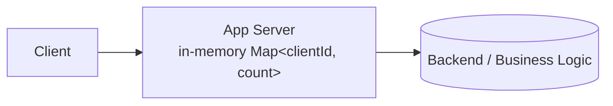
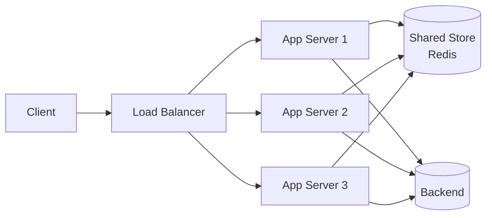
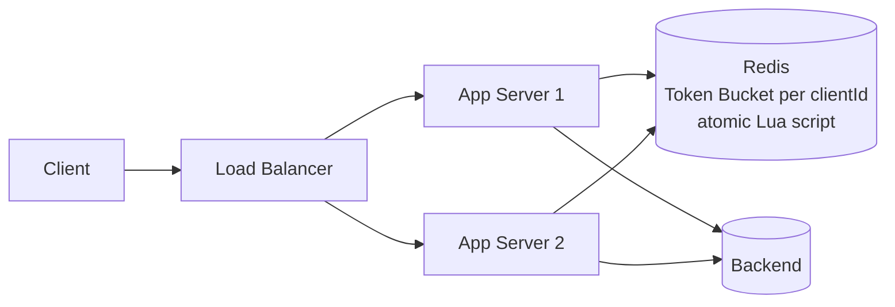
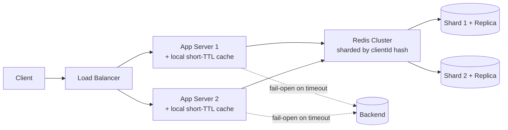
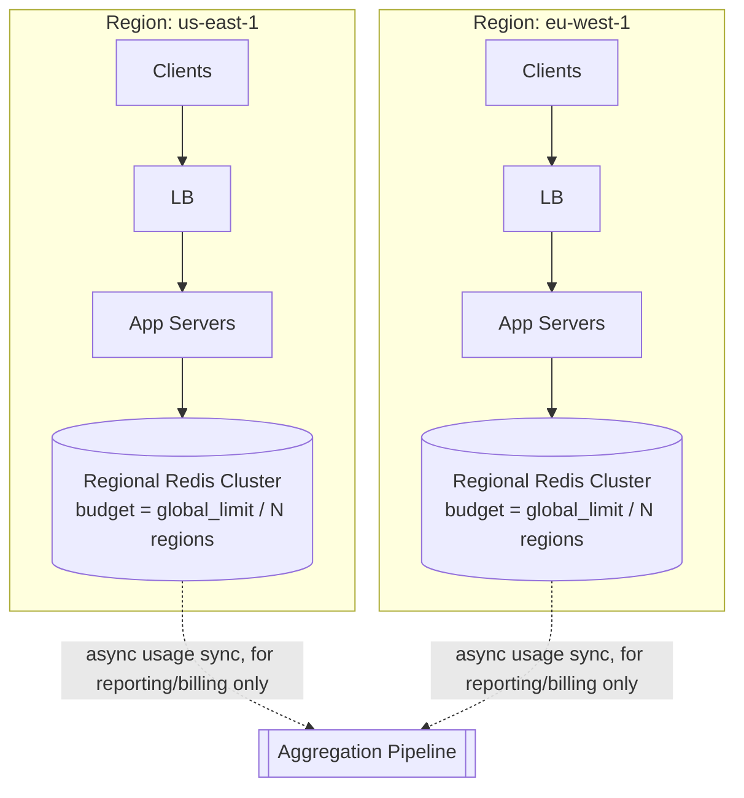
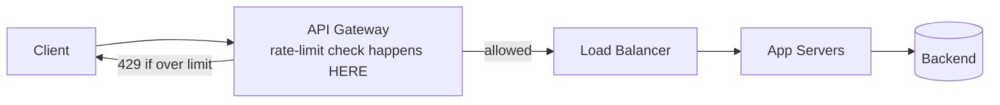

# Distributed Rate Limiter — HLD

The 3rd most-reported Amazon system design prompt (2025–2026 data). It's a great
interview problem because it's small enough to fully design in 45 minutes, but has
enough follow-up depth (algorithms, distributed state, multi-region) that a strong
candidate can keep going deeper the whole time.

A rate limiter protects a service from being overwhelmed — by a single noisy client,
a buggy retry loop, or a deliberate abuser — by capping how many requests an
identity (user, API key, IP) can make in a time window.

---

## Q&A: Functional Requirements

**Q: What must the system do?**

- Limit the number of requests a given client (user ID / API key / IP) can make to a
  given resource within a configured time window (e.g., 100 requests/minute).
- Reject requests that exceed the limit — typically `HTTP 429 Too Many Requests` with
  a `Retry-After` header.
- Support different limits per client tier (free vs. premium) and per endpoint (a
  cheap `GET /product` vs. an expensive `POST /checkout` shouldn't share one limit).
- Let a caller check their current usage/remaining quota (`X-RateLimit-Remaining`).
- Allow limits to be updated by operators without redeploying application servers.

---

## Q&A: Non-Functional Requirements

**Q: What quality attributes actually matter here?**

- **Low latency** — the check sits in the hot path of *every* request to the
  protected service, so it must add only single-digit milliseconds.
- **High availability** — the limiter itself must never become the reason the whole
  platform goes down. This forces an explicit decision: if the limiter's own state
  store is unreachable, do you **fail-open** (allow the request) or **fail-closed**
  (reject it)?
- **Horizontal scalability** — must work across a fleet of stateless application
  servers handling Amazon-scale traffic, not just one box.
- **Approximate correctness is acceptable** — unlike a payment ledger, a rate limiter
  doesn't need a perfectly exact global count; it needs to be *close enough, fast*.
  This trade-off is the crux of the whole design.
- **Fault tolerance** — a crashed node or network blip shouldn't silently let a
  client bypass its limit indefinitely, nor should it take down legitimate traffic.

---

## Q&A: Core Entities

| Entity | Meaning |
|---|---|
| `Client` | The identity being limited — user ID, API key, or IP address |
| `Rule` / `Policy` | A limit definition: `{ resource, limit, windowSeconds, algorithm }` |
| `Counter` | Current usage for a `(client, resource, window)` tuple |
| `RateLimitDecision` | The verdict returned per request: `{ allowed, remaining, resetAt }` |

---

## Q&A: API Design

A rate limiter is usually infrastructure (a library, sidecar, or gateway plugin), not
a consumer-facing product — but it's cleanest to design it as if it were an internal
service with its own API, since that's what an API Gateway or app server would call.

```http
POST /v1/rate-limit/check
Content-Type: application/json
```

Request:
```json
{ "clientId": "apiKey_123", "resource": "POST /checkout", "cost": 1 }
```

Response:
```json
{ "allowed": true, "remaining": 42, "limit": 100, "resetAt": "2026-08-03T10:05:00Z" }
```

Admin API to manage rules:
```http
PUT /v1/rate-limit/rules/{resource}
Content-Type: application/json

{ "limit": 100, "windowSeconds": 60, "algorithm": "token_bucket", "tier": "free" }
```

---

## HLD Walkthrough — Built Incrementally

Each step below deliberately starts too simple, gets challenged, and grows the
**same** diagram by exactly one new capability. This is how you should actually talk
through it out loud in the interview.

### Step 1 — Naive single-server counter



**Q: What's wrong with this?**

It works — on exactly one server. The instant you have more than one app server
behind a load balancer, each server keeps its *own* counter. A client hitting three
different servers effectively gets `3x` the intended limit. Worse, a server
restart/crash silently resets the counter to zero — a client just got a free reset.

### Step 2 — Shared counter store



**Q: What does this fix, and what does it introduce?**

Fixes the duplication problem — one shared source of truth for the count. But now:
1. Every request pays a network round-trip to Redis, right on the hot path.
2. Redis itself must now be fast *and* highly available — it's a brand-new critical
   dependency for every single request the platform serves.
3. We still haven't picked *how* the counting logic actually works — a naive
   `INCR` + fixed time window has a burst problem (see next step).

### Step 3 — Pick a real algorithm (fixed-window's boundary-burst problem)

**Q: What's wrong with the simplest counting approach — increment a counter, reset it
every 60 seconds?**

That's a **Fixed Window Counter**, and it lets a client burst up to `2x` the limit
right at a window boundary: 100 requests at `0:59`, then another 100 at `1:00` — 200
requests inside a 2-second span, both "within limit" by the letter of the rule.



**Q: So which algorithm, and why?**

- **Fixed Window** — simplest, one counter + TTL. Boundary-burst problem above.
- **Sliding Window Log** — store every request timestamp, count how many fall in the
  trailing window. Perfectly accurate, but memory cost scales with request volume.
- **Sliding Window Counter** — blend the current and previous fixed windows,
  weighted by how far into the current window we are. Good accuracy, O(1) memory.
- **Token Bucket** — a bucket refills at a steady rate up to a max size; each request
  consumes a token; no tokens, no request. Naturally smooths bursts while still
  allowing a controlled amount of burst (the bucket size). **This is the practical
  default answer** — it's what most production rate limiters (including AWS's own
  API Gateway throttling) are conceptually built on.
- **Leaky Bucket** — like token bucket but enforces a strictly steady *output* rate
  by queueing excess requests instead of rejecting them immediately — useful when
  smoothing traffic *into* a downstream system matters more than rejecting fast.

Implement Token Bucket atomically in Redis via a Lua script (single round-trip,
avoids race conditions between the "read remaining tokens" and "decrement" steps).

### Step 4 — Redis is now a single point of failure and a hot spot

**Q: At real Amazon-scale traffic, what breaks next?**

Redis becomes both a scaling bottleneck (every request round-trips to it) and a
single point of failure (if it's down, is *every* request now blocked?).



Two changes:
1. **Redis Cluster**, sharded by `clientId` hash, each shard replicated for HA.
2. **Local in-memory cache with a short TTL** on each app server, so most requests
   for a hot client are answered without a network call at all — trading a little
   precision for a lot of throughput.

**Q: What's the cost of that local caching?**

Each app server might allow a few extra requests beyond the *true* global count
during its local cache window — the limiter becomes approximate. That's an
acceptable trade for a protective mechanism (it's not a billing ledger).

**Q: Fail-open or fail-closed if Redis is unreachable?**

State it explicitly, don't leave it implicit: Amazon's typical bias is
**fail-open for customer-facing traffic** (don't let an infra dependency take down
the whole product) and **fail-closed for sensitive/expensive internal operations**
— always paired with an alert, since fail-open silently means "unlimited" until
someone notices.

### Step 5 — Multi-region



**Q: How do you enforce one true global limit across regions without adding
cross-region latency to every request?**

You basically can't, not without paying a cross-region round-trip on the hot path.
The practical approach: split the global budget statically (or dynamically, based on
observed regional traffic share) across regions, enforce each region's slice locally
and fast, and accept the resulting slight over-admission. If an exact global number
is ever needed (e.g., for billing), reconcile it **out-of-band**, asynchronously —
never on the request path.

### Step 6 — Where does the check actually live?

**Q: Should the check run in app code, or somewhere else?**

Push it as close to the edge as possible — an **API Gateway** layer, before requests
ever reach an app server. Rejecting an abusive request at the gateway means it never
consumes app-server compute at all.



---

## Deep Dives (Q&A)

**Q: How do you rate-limit on multiple dimensions at once — per-user AND per-IP AND
per-API-key?**

Run independent rules in parallel, each with its own counter key
(`ratelimit:{apiKey}:{endpoint}`, `ratelimit:{ip}:{endpoint}`). A request is allowed
only if it passes *every* applicable rule.

**Q: How do you keep the limiter itself from becoming the bottleneck at millions of
requests/sec?**

Local pre-checks with periodic async sync to the shared store; shard the store by
key hash so no single node absorbs all the traffic; keep the hot-path operation O(1)
(a single atomic `INCR`/Lua script, no locks, no scans).

**Q: How do you keep one huge tenant from starving others on a shared resource?**

Hierarchical limits: a per-tenant limit *and* a global aggregate limit, optionally
paired with weighted fair queueing at the backend resource itself — rate limiting at
the edge alone doesn't guarantee fairness once requests are admitted.

**Q: How do you change limits dynamically without redeploying?**

Store rules in a config service (e.g., DynamoDB) with app servers/gateways polling
or subscribing to change notifications, cached locally with a short TTL so a config
service blip doesn't take down enforcement.

---

## Common Questions Asked

**Q: Token bucket vs. leaky bucket — what's the actual difference?**
A: Token bucket allows controlled bursts (up to bucket size) and rejects immediately
once empty. Leaky bucket enforces a strictly steady output rate by *queueing* excess
requests instead of rejecting — better when smoothing traffic into a downstream
system matters more than instant rejection.

**Q: Why not just use a normal database for the counter?**
A: Far too slow and too much lock contention for an operation that runs on every
single request. An in-memory store with atomic increment (Redis) is purpose-built
for exactly this access pattern.

**Q: 429 with a clear error vs. silently dropping the request — which is better?**
A: Always the explicit `429` + `Retry-After`. Silent drops make the client's failures
undebuggable and violate the principle of least surprise.

**Q: How would you test that the limiter is actually correct under load?**
A: Load-test with known request patterns and assert observed throughput matches the
configured limit within tolerance; specifically test window-boundary and burst
conditions, since that's where naive implementations break.

---

## Trade-offs Considered

| Decision | Benefit | Cost |
|---|---|---|
| Shared store (Redis) vs. per-server local counters | Correctness across the whole fleet | Extra network hop; new critical dependency |
| Token Bucket vs. Fixed Window | No boundary-burst problem; smooths traffic | Slightly more implementation complexity |
| Fail-open vs. fail-closed on store outage | Fail-open protects overall availability | Fail-open means temporarily unlimited, silently |
| Local caching of counts | Big win on latency/throughput at extreme scale | Approximate, not exact, enforcement |
| Enforce at edge/gateway vs. inside app code | Rejects abuse before it costs compute | Requires investment in a shared gateway layer |
| Per-region static budget split vs. true global count | Low latency, no cross-region calls | Slightly less precise global enforcement |

---

## Alternative Approaches / Technologies

| Component | Primary choice | Alternatives | When to reach for the alternative |
|---|---|---|---|
| Shared counter store | Redis (in-memory, atomic ops, TTL) | DynamoDB with conditional writes (durable, higher latency); Memcached (no scripting, weaker guarantees) | DynamoDB if limiter state must durably survive a full cache-cluster loss |
| Algorithm | Token Bucket | Sliding Window Counter (good approximation, O(1) memory); Sliding Window Log (most accurate, most memory) | Sliding Window Log only when strict accuracy justifies the memory cost (e.g., billing-adjacent limits) |
| Enforcement placement | API Gateway / edge layer | Client-side SDK (cooperative only — never sufficient alone); in-app middleware (fastest to bolt on per-service) | Client SDK as a courtesy first line of defense, never as the sole enforcement |
| Rule storage | Config service (e.g., DynamoDB) + local cache | ZooKeeper/etcd (strong consistency); existing feature-flag infra | Reuse whatever config/feature-flag system the org already runs, rather than building a new one |

---

## Takeaway — Interview Cheat Sheet

- Build order: single-server counter → shared store (fixes correctness, adds a
  dependency) → real algorithm (token bucket, fixes the boundary-burst problem) →
  cluster + local caching (fixes the new single point of failure and hot-path cost)
  → multi-region budget splitting → push enforcement to the edge.
- Always state your **fail-open vs. fail-closed** decision explicitly — this is the
  single most Amazon-flavored moment in the whole design (availability trade-off).
- Know **token bucket vs. sliding window vs. fixed window** cold — it's the most
  common "explain the algorithm" follow-up, almost guaranteed to come up.
