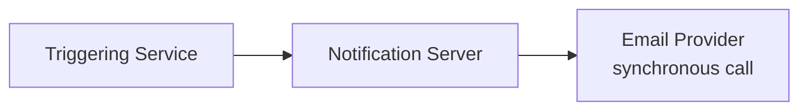
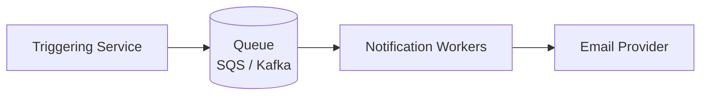
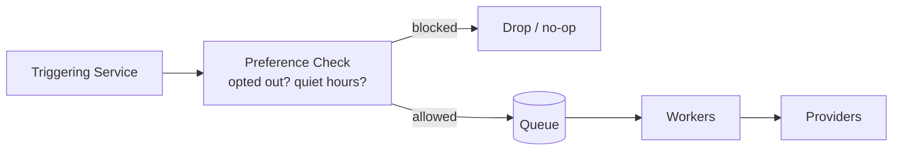
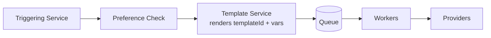
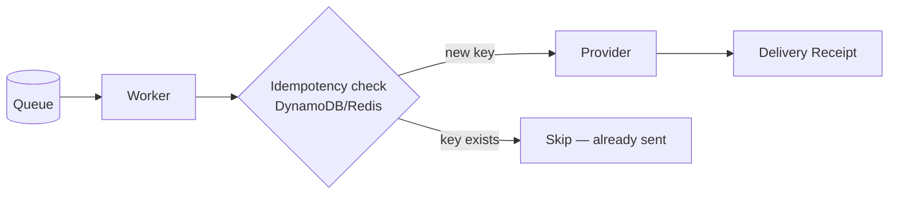
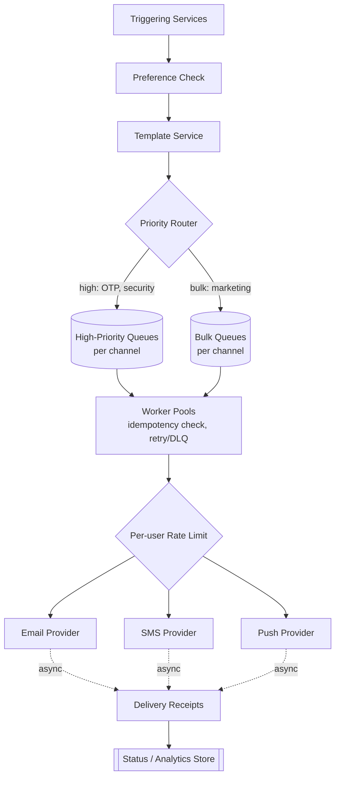

# Notification Service — HLD

The 4th most-reported Amazon system design prompt (2025–2026 data): design a
notification service that can send an "your order shipped" email, a flash-sale
campaign push to millions of users, or a time-critical OTP SMS — reliably, at scale,
across multiple channels.

**This is a distributed-systems / fan-out flavored version of the problem.** It's a
different animal from the notification code already in this repo at
[`../../LLD/03_Questions/NotificationSystem/`](../../LLD/03_Questions/NotificationSystem/),
which is a single-process object-oriented design built around Observer, Decorator,
and Strategy patterns — great for "design the classes," but it says nothing about
queues, retries, or delivering to millions of users. This note is the opposite half
of the problem: scale, delivery guarantees, and multi-channel infrastructure, not
class diagrams.

---

## Q&A: Functional Requirements

**Q: What must the system do?**

- Send notifications via multiple channels — email, SMS, push, in-app.
- Support scheduling a notification for a future time, not just "send now."
- Support templates and personalization (don't hardcode message text per caller).
- Respect per-user, per-channel preferences and opt-outs (and quiet hours).
- Retry on transient failure instead of silently dropping a notification.
- Support priority — an OTP is time-critical; a marketing blast is not, and the two
  must not compete for the same capacity.

---

## Q&A: Non-Functional Requirements

**Q: What quality attributes actually matter here?**

- **High-throughput fan-out** — a single campaign can target millions of users at
  once; the system must absorb that burst without falling over or crushing the
  triggering service.
- **Latency depends on the notification type** — an OTP needs sub-second delivery;
  a marketing campaign can tolerate minutes. One latency SLA does not fit both.
- **Durability** — once a notification is triggered, it must not be silently lost,
  even if a worker crashes mid-send.
- **Idempotency** — a retried or duplicated trigger must not double-notify a user.
  This is the single most-tested property in this design.
- **Per-user rate limiting** — one aggressive producer service (or a bug in one)
  must not be able to spam a single user with dozens of notifications in a minute.
- **Observability** — delivery, open, and click rates need to be tracked without
  slowing down the send path itself.

---

## Q&A: Core Entities

| Entity | Meaning |
|---|---|
| `Notification` | `{ id, userId, channel, templateId, payload, priority, status }` |
| `Template` | A reusable message definition with variable slots for personalization |
| `UserPreference` | `{ userId, channel, optedIn, quietHours }` |
| `DeliveryReceipt` | `{ notificationId, channel, status, timestamp }` — async feedback from the provider |

---

## Q&A: API Design

```http
POST /v1/notifications
Content-Type: application/json
```

Request:
```json
{ "userId": "u_123", "channel": "EMAIL", "templateId": "order_shipped", "payload": { "orderId": "o_9" }, "priority": "NORMAL" }
```

Fan-out / campaign trigger:
```http
POST /v1/notifications/batch
Content-Type: application/json
```

```json
{ "userIds": ["u_1", "u_2", "..."], "templateId": "flash_sale_2026", "channel": "PUSH", "priority": "BULK" }
```

Status check:
```http
GET /v1/notifications/{id}/status
```

User preference management:
```http
GET /v1/users/{id}/notification-preferences
PUT /v1/users/{id}/notification-preferences
```

---

## HLD Walkthrough — Built Incrementally

### Step 1 — Naive synchronous send



**Q: What's wrong with this?**

The triggering service blocks on a slow or unreliable third-party provider for every
single call. There's no retry on failure, the notification server is a single point
of failure, and the design can't absorb a burst — an "order shipped" fan-out to
millions of users would fall over immediately.

### Step 2 — Decouple with a queue



**Q: What does this fix?**

The producer no longer blocks on delivery — it just enqueues and returns. The queue
absorbs bursts instead of them hitting the provider directly, and workers can be
scaled horizontally and retried independently of the triggering service.

### Step 3 — Split by channel

```mermaid
flowchart LR
    T[Triggering Service] --> Q[(Queue)]
    Q --> QE[Email Topic]
    Q --> QS[SMS Topic]
    Q --> QP[Push Topic]
    QE --> WE[Email Workers] --> PE[SES]
    QS --> WS[SMS Workers] --> PS[SNS]
    QP --> WP[Push Workers] --> PP[FCM / APNs]
```

**Q: Why split by channel?**

A slow or down provider on one channel (say SMS) shouldn't stall or back up
notifications on a completely unrelated channel (push). It also lets each worker
pool scale independently based on that channel's own volume — push traffic for a
flash sale looks nothing like SMS/OTP traffic.

### Step 4 — Retries + dead-letter handling

```mermaid
flowchart LR
    Q[(Channel Queue)] --> W[Worker Pool<br/>retry w/ backoff]
    W --> P[Provider]
    W -.permanent failure e.g. invalid number.-> DLQ[(Dead-Letter Queue)]
```

**Q: What happens when a provider call fails?**

Transient failures (timeout, throttling) get retried with exponential backoff.
Permanent failures (invalid phone number, bounced email) go to a dead-letter queue
instead of blocking the main queue or being silently dropped — someone or something
needs to look at DLQ contents.

### Step 5 — Respect user preferences before sending



**Q: Where should the opt-out/quiet-hours check happen?**

Either at enqueue time (cheaper, avoids queueing work that'll be thrown away) or
just before the actual send (more correct, since preferences could change between
enqueue and send for a delayed notification). In practice, do a cheap check at
enqueue and a final authoritative check right before the provider call.

### Step 6 — Template/personalization service



**Q: Why not let each triggering service just build its own message string?**

Every producer would duplicate message logic, and marketing/localization couldn't
change copy without a code deploy. Centralizing rendering in a Template Service
means a template ID plus a variable map is all a caller needs to know, and the
actual text (including localization) is owned in one place.

### Step 7 — Idempotency & dedup

**Q: The queue gives at-least-once delivery — how do you stop a redelivered or
duplicated message from notifying the same user twice?**

Give every logical notification an idempotency key (e.g. hash of
`userId + templateId + triggerContext`, or a client-supplied key). Before actually
calling the provider, a worker does a check-and-set of that key against a store with
a TTL (DynamoDB conditional write, or Redis `SETNX`). If the key already exists, the
send is skipped — it's already in flight or already done.



### Step 8 — Priority + per-user rate limiting

**Q: What happens when a huge marketing campaign is queued right when a user needs
an OTP to log in?**

Without separation, the OTP sits behind millions of bulk messages. Split into a
high-priority queue (OTP, security alerts, transactional) and a bulk/marketing queue
with its own, much larger, worker pool — the two never compete for the same
capacity. Add per-user rate limiting so one buggy or aggressive producer can't spam
a single user — for the mechanics of that, see
[`02_Rate_Limiter.md`](02_Rate_Limiter.md) in this folder rather than re-deriving it
here.

**Final architecture:**



---

## Deep Dives (Q&A)

**Q: Can you actually guarantee exactly-once delivery end-to-end?**

No — not across a network boundary to a third-party provider you don't control.
Queues realistically give at-least-once delivery, and a provider call can succeed
but the acknowledgment can be lost, making a retry look necessary when it isn't. The
practical, honest answer everyone actually ships is **at-least-once delivery +
idempotent handlers** (Step 7) — not true exactly-once.

**Q: How do you handle a sudden fan-out to millions of users (e.g. a flash sale)
without overwhelming downstream providers?**

Queue-based buffering absorbs the burst on the ingest side; on the send side, throttle
worker concurrency to match what the provider itself allows (providers rate-limit
you — SES, SNS, and FCM all have send-rate caps), and let the bulk queue simply drain
over minutes rather than trying to blast everything at once.

**Q: How do you handle a provider outage (e.g. SES is down)?**

Wrap the provider call in a circuit breaker so a struggling provider doesn't tie up
every worker thread retrying against it. Fail over to an alternate provider or
channel if one's configured, keep retrying the primary with backoff, and alert
on-call — don't let it fail silently.

**Q: How do you avoid "notification storms" — several different events all wanting
to notify the same user within a minute?**

Batch/coalesce related notifications into a single digest instead of firing each one
individually — e.g. "3 people liked your post" instead of three separate pushes.
This is a product decision as much as an infra one, but the infra needs a short
buffering/aggregation window to make it possible.

**Q: How do you support scheduling a notification for a future time?**

For short delays, a queue's native delay feature is enough (e.g. an SQS delay
queue, capped at 15 minutes). For longer or recurring delays, you need a real
time-bucketed scheduler — see
[`05_Distributed_Job_Scheduler.md`](05_Distributed_Job_Scheduler.md) in this folder,
which is exactly that problem.

---

## Common Questions Asked

**Q: Push vs. poll for delivery status back to the triggering service?**
A: Push — providers send async delivery/bounce webhooks, which update the
`DeliveryReceipt` store; the triggering service (or a dashboard) reads that store
rather than polling the provider directly.

**Q: How do you track open/click rates without slowing down delivery?**
A: Never do it inline. Emit an async event (open pixel hit, link click) onto an
event stream and process it separately into an analytics store — the same
"decouple analytics from the hot path" pattern you'd use for click-analytics in a
URL shortener design.

**Q: What if a user has no valid contact info for a channel (no phone number on
file, for example)?**
A: Fail fast at the preference-check step rather than queueing a doomed send —
return/record a clear "no valid destination" status instead of letting it bounce
through retries and land in the DLQ.

**Q: Any multi-region considerations?**
A: Keep queues and worker pools regional so a region can process its own user base
without cross-region hops on the hot path; delivery receipts/analytics can
aggregate centrally, async, out of band — same pattern as the multi-region section
in [`02_Rate_Limiter.md`](02_Rate_Limiter.md).

---

## Trade-offs Considered

| Decision | Benefit | Cost |
|---|---|---|
| Async (queue-based) vs. synchronous delivery | Producer never blocks; absorbs bursts | Added latency and infra complexity vs. a direct call |
| Per-channel queues vs. one shared queue | A slow/down channel can't stall the others | More queues/topics to provision and monitor |
| Idempotency check on every send | Eliminates duplicate-notification risk | Extra read/write per notification, and a new store to keep available |
| Strict priority queue vs. simple FIFO | Time-critical sends (OTP) never wait behind bulk backlog | Bulk/marketing traffic can be starved if priority isn't capacity-bounded |

---

## Alternative Approaches / Technologies

| Component | Primary choice | Alternatives | When to reach for the alternative |
|---|---|---|---|
| Queue | SQS (managed, simple, per-queue delay/DLQ built in) | Kafka (higher throughput, replayable log, more ops overhead) | Kafka when you need consumer replay or are already standardized on it for other event streams |
| Channel providers | AWS-native: SES (email), SNS (SMS/push), FCM/APNs (push) | Third-party: Twilio, SendGrid | Third-party when you need deliverability features or reach AWS-native options don't cover well |
| Idempotency store | DynamoDB conditional writes (durable) | Redis `SETNX` with TTL (faster, less durable) | Redis when raw speed matters more than surviving a full cache loss; DynamoDB when the dedup record must be durable |
| Delayed/scheduled sends | SQS delay queue (short delays, ≤15 min) | Dedicated scheduler service (see `05_Distributed_Job_Scheduler.md`) | Dedicated scheduler for anything longer than a queue's native delay cap, or recurring sends |

---

## Takeaway — Interview Cheat Sheet

- Build order: sync call → queue decouples producer from provider → split by
  channel → retries/DLQ → gate on user preferences → centralize templates →
  idempotency → priority + per-user rate limiting.
- The core insight: this is fundamentally a **fan-out + delivery-guarantee**
  problem, not a UI or class-design problem — that's what separates this note from
  the LLD Observer/Strategy version of "Notification System" in this repo.
- Know **at-least-once + idempotent handlers** cold as the answer to "can you do
  exactly-once?" — it will come up, and it's the same answer as
  `05_Distributed_Job_Scheduler.md`.
