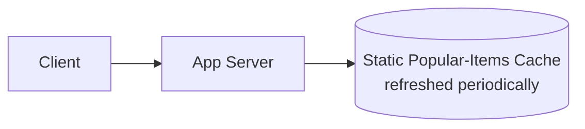
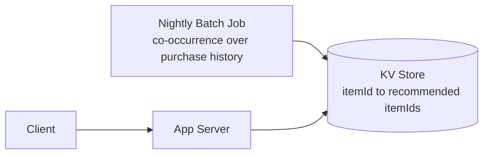
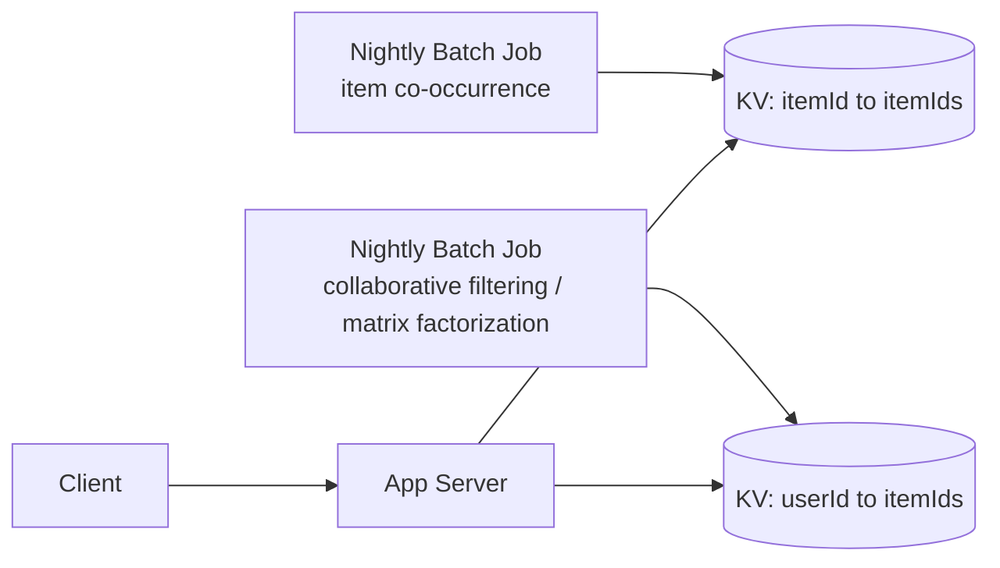
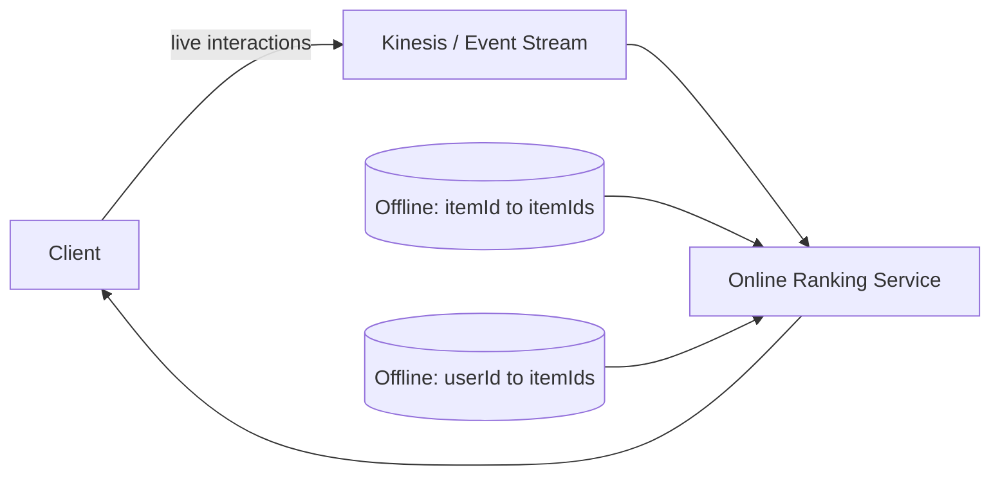
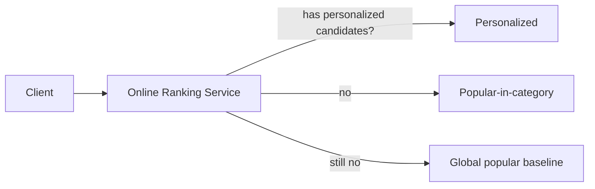
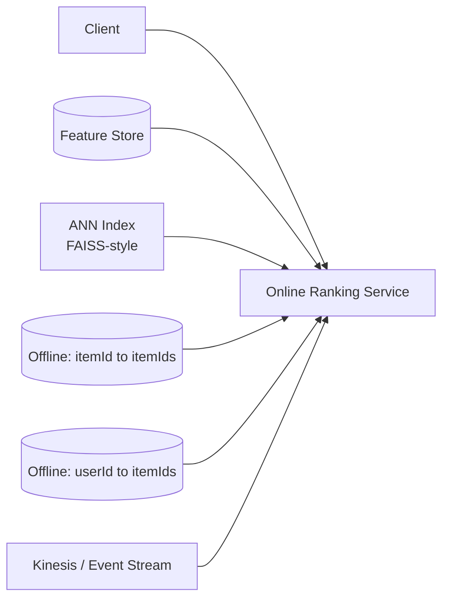
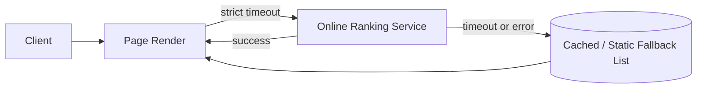
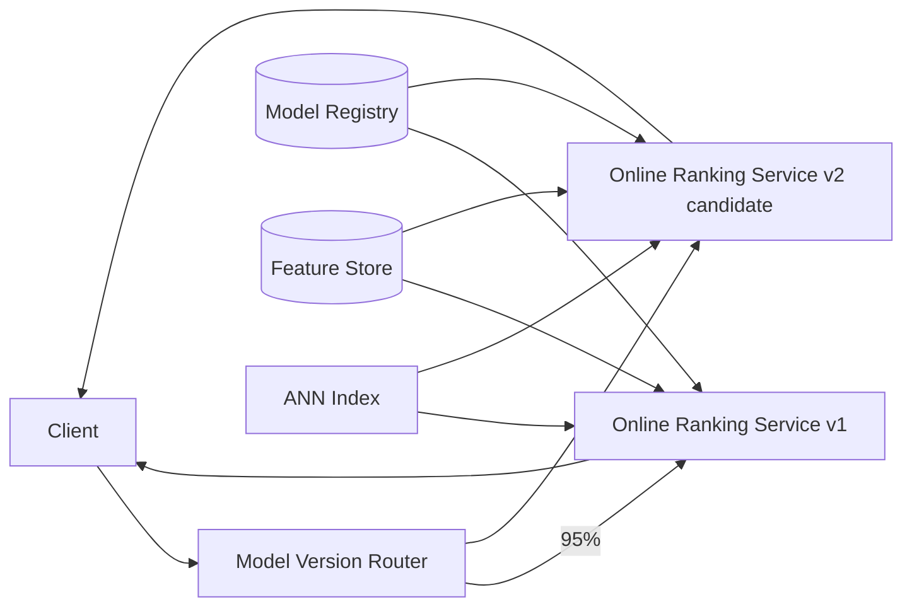

# Recommendation System — HLD

The 2nd most-reported Amazon system design prompt (2025–2026 data) — and about as
on-brand as it gets, since it's literally Amazon's own product ("customers who bought
this also bought," homepage personalization, search re-ranking). It's more
**ML-systems-flavored** than the other, "purer infra" problems in this folder — there's
a model in the loop, not just a data structure — but the same HLD skeleton still
applies: requirements → entities → API → incremental architecture → deep dives →
trade-offs. You don't need to be an ML expert; you need to reason about the *systems*
around the model (serving latency, staleness, fallback behavior) the same way you would
for any other distributed system.

---

## Q&A: Functional Requirements

**Q: What must the system do?**

- Generate personalized product recommendations for a user across multiple surfaces:
  homepage ("recommended for you"), product pages ("customers who bought this also
  bought"), and search re-ranking (reorder search results toward what this user is
  likely to engage with).
- Support both **online/real-time** recommendations (reacting to what the user is
  doing *this session*) and **offline/batch** recommendations (precomputed, cheaper,
  based on historical behavior).
- Handle **cold start** gracefully — a brand-new user with no history, and a
  brand-new product with no interaction data.
- Support **A/B testing** of different recommendation models/strategies against each
  other, safely, on live traffic.
- (Nice-to-have) Support **explanations** — "recommended because you viewed X" —
  which both builds user trust and is a common follow-up question.

---

## Q&A: Non-Functional Requirements

**Q: What quality attributes actually matter here?**

- **Extremely low latency** — recommendations sit directly in the page-load critical
  path. The budget is **tens of milliseconds**, not hundreds — this single constraint
  shapes almost every architectural decision below.
- **Scale** — hundreds of millions of users, a catalog of hundreds of millions of
  items. Naive "score every item for every user" approaches are off the table by
  orders of magnitude.
- **Freshness vs. cost trade-off** — real-time behavioral signal (what did the user
  just click) is expensive to compute per-request; full offline retraining is cheap
  per-user but stale. The design has to blend both, not pick one.
- **High availability with graceful degradation** — recommendations must **never**
  block page render. If the recommendation service is slow or down, the page still
  has to load, just with a less-personalized fallback.
- **Privacy** — recommendations are built from behavioral data; the design should be
  able to speak to data retention and opt-out, even if it isn't the interview's main
  focus.

---

## Q&A: Core Entities

| Entity | Meaning |
|---|---|
| `User` | The person receiving recommendations |
| `Item` / `Product` | The thing being recommended |
| `Interaction` / `Event` | `{ userId, itemId, type (view/click/purchase/rating), timestamp }` |
| `UserEmbedding` / `ItemEmbedding` | Dense vector representation used for similarity/ranking |
| `RecommendationRequest` / `Response` | `{ userId, context, candidates[], scores[] }` |
| `ModelVersion` | An identifiable, deployable version of a ranking/candidate model |

---

## Q&A: API Design

```http
GET /v1/recommendations?userId=U123&context=homepage&limit=20
```

Response:
```json
{
  "userId": "U123",
  "context": "homepage",
  "items": [
    { "itemId": "P789", "score": 0.94, "reason": "viewed_similar" },
    { "itemId": "P456", "score": 0.91, "reason": "trending_in_category" }
  ],
  "modelVersion": "v2026-08-01"
}
```

**Q: How does the system learn about what the user just did — is that a synchronous
API call too?**

No — and this is a common point of confusion worth calling out explicitly.
Interaction logging is **not** a request/response API call. It's an **async event
stream**: as the user browses, `Event` objects (`{ userId, itemId, type, timestamp }`)
are published to a stream (Kinesis/Kafka) and consumed downstream by the recommendation
pipeline. Logging must add **zero** latency to the user's actual browsing action —
firing an event is fire-and-forget, never something the click handler waits on.

---

## HLD Walkthrough — Built Incrementally

### Step 1 — Naive non-personalized baseline



**Q: What's wrong with this?**

Zero personalization — it completely ignores who the user is or what they've done, so
relevance and conversion are poor. That said, don't throw this away as a mere
strawman: a global "most popular" list is cheap, always available, and never empty —
it's a legitimate fallback tier we'll come back to in Step 5.

### Step 2 — Item-to-item collaborative filtering, precomputed offline

**Q: What's the simplest thing that's actually personalized to *something*?**

Not to the user yet — to the *item*. A nightly batch job scans purchase history and
computes co-occurrence: "customers who bought X also bought Y." The result is stored
as a simple `itemId → List<itemId>` lookup.



This is exactly a key-value store access pattern — a single hash lookup by key, no
ranking logic at request time — see
[`../../HLD/Key_Value_Store.md`](../../HLD/Key_Value_Store.md) for the storage mechanics
(partitioning, replication) rather than re-deriving them here.

**Q: What's still missing?**

This only covers item-to-item recs (product page "also bought"). There's nothing
personalized at the *user* level for the homepage, and it's up to a full day stale
since it only refreshes on the nightly batch run.

### Step 3 — User-level offline recommendations



A second offline batch job — collaborative filtering, matrix factorization, or an
embedding model over historical interactions — produces a `userId → List<itemId>`
table, served the same way via a fast KV/cache lookup.

**Q: What's the next problem?**

**Cold start.** Brand-new users and brand-new items have no historical interaction
data at all, so the offline job has literally nothing to base a recommendation on.
And it's still up to a day stale — it can't react to what the user is doing in *this*
session, right now.

### Step 4 — Add a real-time/online layer

**Q: How do we react to what the user is doing right now, without recomputing
everything from scratch per request?**

Stream the user's live interaction events through an event pipeline into a
lightweight online re-ranking service that blends the precomputed offline candidates
with in-session signal.



This is the standard **two-stage architecture**, worth naming explicitly in the
interview:

1. **Candidate generation** (offline) — cheap, broad, batch. Narrows hundreds of
   millions of items down to maybe a few hundred plausible candidates per user.
2. **Ranking / re-ranking** (online) — fast, narrow, uses live session features.
   Takes those few hundred candidates and scores/orders them down to the final ~20
   shown, within the latency budget.

You never rank the whole catalog online — that's the whole point of splitting it this
way (more in Deep Dives).

### Step 5 — Handle cold start explicitly with fallback tiers

**Q: A brand-new user just signed up. What do they see?**

Never an empty response. Fall back through a tier chain: personalized candidates →
if none exist, popular-in-category (inferred from whatever weak signal exists, e.g.
referral source or first click) → if still nothing, the global-popular baseline from
**Step 1**. This is exactly why Step 1 wasn't thrown away — it becomes the floor of
the fallback chain.



**Q: What about brand-new items with no interaction history yet?**

Deliberately boost them with a small amount of **exploration** traffic so they can
accumulate enough signal to earn their way into normal ranking — otherwise a new item
never gets shown, never gets clicked, and therefore never has data to justify showing
it: a cold-start deadlock. This is the **explore vs. exploit** trade-off, worth naming
explicitly here since it recurs in Deep Dives.

### Step 6 — Low-latency serving infrastructure

**Q: The online ranking service needs to score candidates against a live user
embedding within single-digit-to-tens of milliseconds. How?**

Precompute embeddings offline (both user and item), store them in a low-latency
store, and use **Approximate Nearest Neighbor (ANN)** search (a FAISS-style index) to
find "similar items" at request time within budget — exact nearest-neighbor search
over hundreds of millions of items is not fast enough; approximate is the accepted
trade-off.

Also introduce a **feature store**: a shared source of truth for features (recent
click count, category affinity, etc.) so the *offline training* pipeline and the
*online serving* path compute the same feature the same way. This avoids
**train/serve skew** — a very common deep-dive follow-up, name it explicitly.



### Step 7 — Graceful degradation

**Q: What happens if the online ranking service is slow right now?**

The call from the page-render path must carry a **strict timeout**. If it doesn't
respond in time, fall back to a cached/static list rather than ever blocking the
page. This is the same fail-open/availability-first philosophy already established
for the rate limiter in
[`02_Rate_Limiter.md`](02_Rate_Limiter.md) — an infra dependency being slow or down
should never be the reason the whole page fails to render.



### Step 8 — A/B testing & model versioning

**Q: How do you ship a new ranking model without risking the whole platform?**

Route a percentage of traffic to a new model version via a version router, track
business metrics (CTR, conversion) alongside guardrail metrics (latency, error rate,
revenue), and roll out gradually — this is the final architecture.



---

## Deep Dives (Q&A)

**Q: Why not just rank the entire catalog directly for every user? Why the two-stage
split?**

Ranking is expensive *per item* (it uses rich features, possibly a heavy model). Doing
that for hundreds of millions of items, per request, within a tens-of-milliseconds
budget is impossible. Candidate generation is a cheap, broad first pass (co-occurrence,
ANN similarity, popularity) that narrows the field to a few hundred plausible items;
the expensive ranking computation is then spent only on those few hundred.

**Q: More on cold-start strategies — what do you do for a genuinely new item with zero
interactions?**

Fall back to **content-based** signal — item metadata (category, brand, text
description, price band) instead of purely behavioral/collaborative signal — until
enough interaction data accumulates for collaborative methods to kick in. This is
also why a hybrid (content-based + collaborative) beats either alone in practice.

**Q: Why does a feature store matter so much — what breaks without one?**

If the offline training pipeline computes a feature (say, "user's click rate on this
category in the last 7 days") one way, and the online serving path computes the
"same" feature slightly differently — different windowing, different null-handling,
a subtle timezone bug — the model was trained on one distribution and is being
queried with another. This **train/serve skew** silently degrades model quality with
no obvious error anywhere; a shared feature store, used by both paths, eliminates the
whole class of bug by construction.

**Q: Explore vs. exploit — go deeper.**

Formally, this is a multi-armed bandit problem. Always showing only "known good"
items maximizes short-term CTR, but starves new/niche items of the exposure they'd
need to ever accumulate signal — the catalog's long tail never surfaces, hurting
long-term catalog health and seller diversity. The fix is deliberately reserving a
small slice of traffic for exploration (new/uncertain items), trading a little
short-term engagement for better long-term coverage.

**Q: How do you evaluate whether a new model is actually better?**

Two layers. First, offline metrics — precision@k, recall@k — computed against
historical data, cheap and fast, good for filtering out obviously-bad candidates
before they ever see real traffic. But offline metrics don't always correlate with
real user behavior. The real answer is **online A/B testing** against business
metrics (CTR, conversion, revenue per session), with guardrail metrics watched
simultaneously so a model that "wins" on the primary metric isn't secretly regressing
latency or diversity.

---

## Common Questions Asked

**Q: Content-based vs. collaborative filtering vs. hybrid — the one-liner?**
A: Content-based recommends by item similarity (metadata/attributes); collaborative
filtering recommends by behavior similarity (what similar users/items did); hybrid
blends both and is what production systems actually run, since each covers the
other's weak spot (collaborative struggles at cold start, content-based ignores
behavioral signal).

**Q: How do you handle a user with zero history?**
A: Cold start — fall back through content-based signal and then the popularity
fallback chain (Step 5), never returning an empty response.

**Q: How do you keep recommendations from feeling stale within a single session?**
A: The online re-ranking layer from Step 4 — it blends the (up to a day old) offline
candidates with live in-session signal, so a user's last few clicks visibly shift
what's shown next.

**Q: How would you detect and mitigate a filter bubble / popularity bias?**
A: Detect via diversity/coverage metrics tracked alongside CTR (e.g., what fraction
of the catalog gets meaningfully surfaced over time). Mitigate with the same
explore/exploit mechanism from Step 5 — deliberately inject exploration traffic and
diversity constraints into ranking rather than optimizing for pure predicted CTR.

---

## Trade-offs Considered

| Decision | Benefit | Cost |
|---|---|---|
| Offline batch vs. online real-time | Offline is cheap, scalable, good baseline coverage | Online is needed for freshness/session-reactivity but costs more per request |
| Collaborative filtering vs. content-based | Collaborative captures behavioral nuance better | Content-based is the only option at cold start; hybrid needed for full coverage |
| Personalization depth vs. latency budget | Richer features/models improve relevance | Every added feature/model hop risks blowing the tens-of-ms serving budget |
| Exploration vs. exploitation | Keeps new/niche items discoverable, healthier long-term catalog | Costs some short-term CTR/conversion by showing less-certain items |

---

## Alternative Approaches / Technologies

| Component | Primary choice | Alternatives | When to reach for the alternative |
|---|---|---|---|
| Candidate/feature store | DynamoDB (simple key lookups, AWS-native) | Dedicated vector database / ANN service for embedding similarity | When candidate generation is embedding-similarity-based, not just co-occurrence lookups |
| Streaming platform | Kinesis (AWS-native default) | Kafka | Kafka if already standardized elsewhere in the org, or multi-cloud is required |
| Batch compute | EMR / Spark | Any large-scale batch framework | Reuse whatever the org's existing data-platform standard is |
| Model training/serving | SageMaker (AWS-native default) | Self-hosted training/serving stack | Self-hosted if extreme customization or cost control at massive scale outweighs managed convenience |
| Feature store | Redis-backed simple store | Dedicated feature-store product (e.g. Feast) | Dedicated product once feature reuse across many models/teams becomes the bottleneck, not just serving speed |
| Caching layer | ElastiCache (AWS-native default) | Local in-process cache | Local cache for the hottest, smallest slice of traffic (e.g. edge/CDN-adjacent) |

---

## Takeaway — Interview Cheat Sheet

- Build order: static popular baseline → offline item-to-item CF (KV lookup) →
  offline user-level CF → online real-time re-ranking layer (two-stage architecture)
  → explicit cold-start fallback chain + explore/exploit → low-latency serving
  infra (embeddings, ANN, feature store) → graceful degradation on the page-render
  path → A/B testing and model versioning.
- The core insight: this is fundamentally a **two-stage architecture** — cheap broad
  candidate generation, then expensive narrow ranking. Naming that pattern explicitly
  and early signals real system-design maturity beyond "just use ML."
- Know the **cold-start fallback chain** (personalized → popular-in-category →
  global popular) and the **fail-open/graceful-degradation** principle cold — both
  come up almost every time, and the latter is the same principle already established
  in [`02_Rate_Limiter.md`](02_Rate_Limiter.md).
