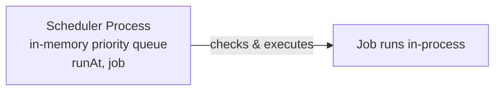
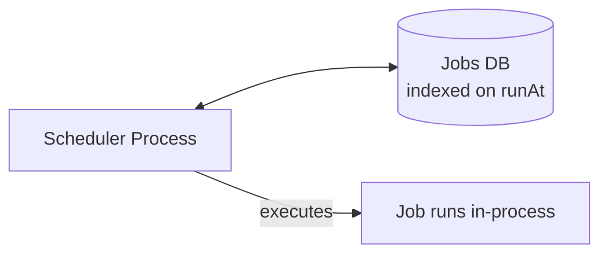
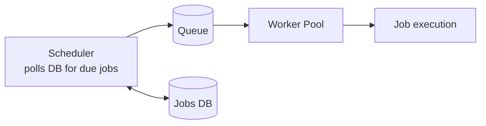
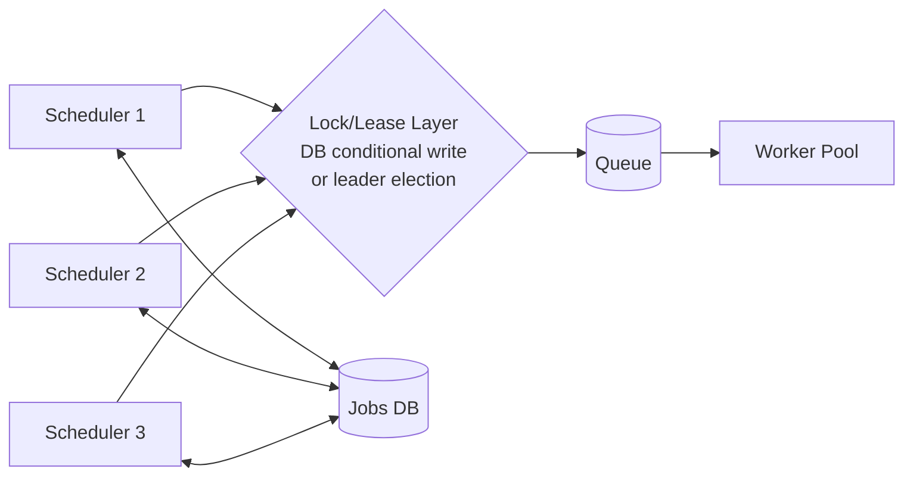
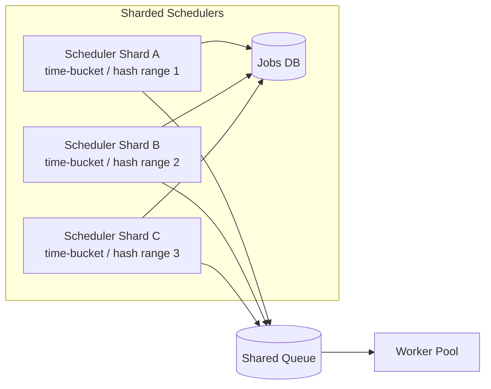
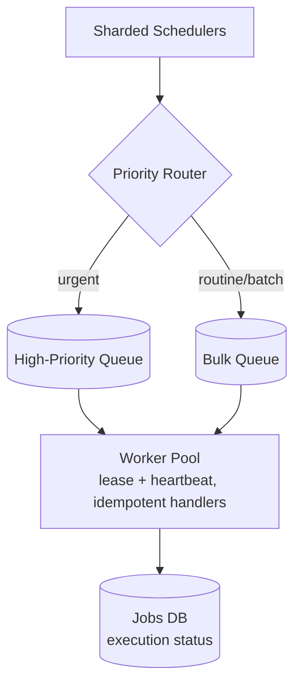

# Distributed Job Scheduler — HLD

Reported directly in Amazon interviews as "design a system to schedule jobs in a
distributed environment." It fits Amazon's operational domain naturally — think
nightly inventory-reconciliation jobs across fulfillment centers, or a delayed
order-cancellation job that fires if a payment isn't confirmed within 30 minutes.

A job scheduler decides **what work is due** and hands it off for execution, whether
that's a one-time job ("run this at 3am tomorrow") or a recurring one ("run this
every night at 2am"), and it has to keep doing that correctly even as individual
nodes crash.

---

## Q&A: Functional Requirements

**Q: What must the system do?**

- Schedule a job to run once at a specific time, or recurring on a cron-like
  expression.
- Guarantee a job still runs even if the node that was supposed to trigger it
  crashes right before firing.
- Support job priority (an urgent reconciliation job vs. a routine nightly report).
- Retry a failed job with backoff.
- Allow an existing job to be cancelled or rescheduled.
- (Advanced, brief mention) Support job dependencies — job B only becomes eligible
  once job A succeeds.

---

## Q&A: Non-Functional Requirements

**Q: What quality attributes actually matter here?**

- **No single point of failure in the scheduler itself** — the component deciding
  "what's due right now" can't be one fragile box.
- **Scale to millions of scheduled jobs** — a naive full-table scan for "what's due"
  falls over well before that.
- **Fault tolerance** — a worker crashing mid-execution shouldn't lose the job, and
  (without care) recovering from that crash shouldn't cause it to silently double-run.
- **Low scheduling latency/jitter** — a job due at `2:00:00` should fire close to on
  time, not drift by minutes because the scheduler is backed up.
- **Effectively-exactly-once execution** via idempotency, since true exactly-once
  isn't achievable end-to-end (see Deep Dives).
- **Observability** into success/failure rates and scheduling lag — you need to know
  when jobs are starting late before a customer does.

---

## Q&A: Core Entities

| Entity | Meaning |
|---|---|
| `Job` | `{ id, cronExpression or runAt, payload, status, retryPolicy, priority }` |
| `Execution` / `Run` | One record per actual trigger of a job — distinct from the `Job` definition itself |
| `Worker` | A process that pulls due work off a queue and executes it |
| `Lease` / `Lock` | A time-bound ownership claim on a due job or in-progress execution |

---

## Q&A: API Design

```http
POST /v1/jobs
Content-Type: application/json
```

One-time:
```json
{ "runAt": "2026-08-04T02:00:00Z", "payload": { "type": "inventory_reconcile", "fcId": "SEA1" } }
```

Recurring:
```json
{ "cronExpression": "0 2 * * *", "payload": { "type": "nightly_report" }, "priority": "NORMAL" }
```

```http
DELETE /v1/jobs/{id}          # cancel
PUT    /v1/jobs/{id}          # reschedule
GET    /v1/jobs/{id}          # status/history
```

---

## HLD Walkthrough — Built Incrementally

### Step 1 — Naive single-process scheduler



**Q: What's wrong with this?**

Single point of failure, throughput capped at one machine, and — worst of all — an
in-memory queue means every scheduled job vanishes the moment the process crashes or
restarts.

### Step 2 — Persist jobs



**Q: What's still wrong?**

Jobs survive a restart now, but it's still one active scheduler instance both
deciding *and* executing — still a single point of failure for execution capacity,
and a single slow-running job blocks the loop from checking or firing the *next*
due job.

### Step 3 — Separate scheduling from execution



**Q: What does this fix?**

The scheduler's only job now is "find what's due, push it onto a queue." Execution
scales independently via a horizontally-scalable worker pool, and a slow job no
longer blocks the scheduling loop from checking the next batch of due jobs.

### Step 4 — Multiple scheduler instances for HA



**Q: The obvious problem — if two scheduler instances both poll and see the same due
job, don't they both enqueue it, causing a double execution?**

Yes, without a coordination layer. Two options:

1. **Distributed lock per job at claim time** — an atomic/conditional "claim" write
   (e.g. a DynamoDB conditional update that only succeeds if this run isn't already
   claimed). Simple, no separate coordination service.
2. **Full leader election** (ZooKeeper/etcd) so only one scheduler instance is
   actively polling at any moment, with automatic failover promoting a standby if
   the leader dies. More moving parts, but a cleaner mental model.

Either way, running multiple scheduler instances removes the earlier single point of
failure for the *scheduling* role, not just execution.

### Step 5 — Worker crash mid-execution

**Q: A worker dies partway through a job — how does the system notice and recover?**

Workers heartbeat/renew a lease on their in-progress `Execution` record. If
heartbeats stop, the lease expires and another worker is allowed to pick the job
back up.

**Q: What does that recovery path require of the job itself?**

The job handler **must be idempotent**. The recovery path can legitimately cause the
same job to run twice — e.g. a worker completes the real work but crashes before
marking the execution done, so a second worker picks it up and reruns it. This is
the same "at-least-once + idempotent handlers" principle as
[`03_Notification_System.md`](03_Notification_System.md) — true exactly-once
execution isn't achievable here either.

### Step 6 — Recurring / cron jobs

**Q: How do recurring jobs fit the same model as one-shot jobs?**

Model a recurring job as `{ cronExpression, nextRunAt }` instead of a one-off row.
After each successful run, compute the next fire time from the cron expression and
update `nextRunAt` — the scheduler's "find due jobs" query (`WHERE nextRunAt <= now`)
doesn't need to know or care whether a job is one-shot or recurring.

### Step 7 — Scale the "due jobs" polling itself



**Q: At millions of scheduled jobs, does "poll the whole table" still work?**

No — partition jobs by time-bucket and/or job-ID hash across multiple scheduler
shards, each owning a range and only responsible for polling its own slice. This is
the *same* consistent-hashing/partitioning idea used in
[`../../HLD/Key_Value_Store.md`](../../HLD/Key_Value_Store.md) for distributing key
storage across nodes — here it's applied to "who is responsible for polling which
jobs" instead of "who stores which keys."

### Step 8 — Priority & backpressure

**Q: What happens when a huge batch of routine jobs is due at the same time as one
urgent job?**

Same principle as [`03_Notification_System.md`](03_Notification_System.md)'s
priority routing: separate a high-priority queue from a bulk/backlog queue so a
time-critical job isn't stuck behind a large batch backlog waiting its turn.



---

## Deep Dives (Q&A)

**Q: Is "exactly-once execution" actually achievable?**

No — same conclusion as the notification system design. At-least-once triggering
combined with idempotent job handlers (Step 5) is the practical, honest answer; a
crash at the wrong instant can always cause a duplicate attempt, so the handler
itself must tolerate that.

**Q: If the whole system is down for hours and comes back, do all the missed
recurring jobs fire at once — a "catch-up storm"?**

This needs an explicit missed-run policy, and it should be a property of the job
type, not a global default:
- **Skip-and-resume-from-now** — just compute the next future `nextRunAt` and move
  on (fine for a routine report).
- **Run-once-to-catch-up** — fire the job a single time for the gap, then resume
  normal cadence.
- **Backfill-all-missed** — actually run every missed occurrence (rare, only for
  jobs where each individual run matters, e.g. per-day financial close).

**Q: How do you avoid a thundering herd when many jobs are due at exactly the same
second (e.g. everyone scheduled for the top of the hour)?**

Add jitter to the actual fire time (a few seconds of randomness), or stagger
enqueue time slightly — spreads load without meaningfully affecting correctness.

**Q: How do you handle clock skew across scheduler nodes?**

NTP-sync all nodes, and don't design the due-check assuming perfect synchrony — a
small tolerance window in the "is this due yet" comparison absorbs normal drift
without letting jobs fire wildly early or late.

---

## Common Questions Asked

**Q: How do you guarantee a job doesn't run twice?**
A: You don't guarantee it never runs twice — you guarantee it's *safe* if it does,
via idempotent job handlers plus lease-based ownership so at most one worker is
normally executing a given run at a time.

**Q: How would you support job dependencies/DAGs at a high level?**
A: A job only becomes eligible once its declared dependencies report success —
essentially a lightweight workflow engine layered on top of this scheduler. Worth
naming as a natural extension, but don't over-invest in it unless asked to go
deeper — it's a materially bigger system (think Airflow/Temporal territory).

**Q: Any cron expression edge cases worth knowing?**
A: DST transitions (a `2:30am` job on the "spring forward" day that doesn't exist)
and leap years/Feb 29 recurrences — both are worth a one-liner acknowledging you'd
pin scheduling to UTC internally and handle the DST/leap edge explicitly rather than
let the cron library silently do something surprising.

---

## Trade-offs Considered

| Decision | Benefit | Cost |
|---|---|---|
| DB-conditional-write locking vs. full leader election | Simpler, no extra coordination service | Leader election gives a cleaner "exactly one active poller" guarantee |
| Skip vs. catch-up policy for missed recurring runs | Skip avoids a load spike after an outage | Catch-up avoids silently missing business-critical runs |
| Sharding by time-bucket vs. by job-ID hash | Time-bucket keeps "what's due soon" queries cheap | Hash sharding balances load more evenly if job-run-time distribution is lumpy |
| Strict priority queue vs. simple FIFO | Urgent jobs never wait behind a big batch backlog | Bulk jobs can be starved without a fairness/capacity bound |

---

## Alternative Approaches / Technologies

| Component | Primary choice | Alternatives | When to reach for the alternative |
|---|---|---|---|
| Queue | SQS | Kafka | Kafka if you need replay or are already standardized on it elsewhere |
| Distributed locking / leader election | DynamoDB conditional writes (lightweight) | ZooKeeper/etcd (full leader election) | etcd/ZooKeeper when you want a hard single-active-poller guarantee rather than per-job claims |
| Job storage | DynamoDB | Relational DB (Postgres/MySQL) | Relational when you need rich querying over job history or dependency graphs |
| Off-the-shelf comparison | — | Airflow, Temporal, AWS EventBridge Scheduler | Naming one of these in the interview shows awareness that this problem is largely solved rather than always built from scratch |

---

## Takeaway — Interview Cheat Sheet

- Build order: single-process scheduler → persist jobs → separate scheduling from
  execution → multiple scheduler instances + locking for HA → lease/heartbeat for
  worker-crash recovery → model recurring jobs → shard the due-jobs poll → priority
  + backpressure.
- The core insight: **scheduling** (deciding what's due) and **execution** (doing
  the work) must be separated early — nearly every later fix in this design follows
  directly from that split.
- Know the idempotent-handler answer to "can you guarantee exactly-once?" cold — the
  same answer as [`03_Notification_System.md`](03_Notification_System.md), and it
  will come up.
