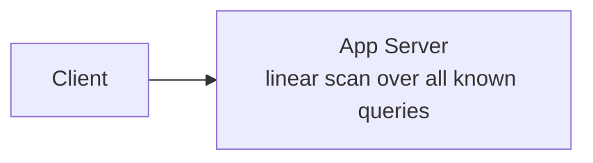
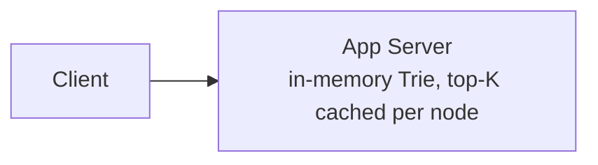
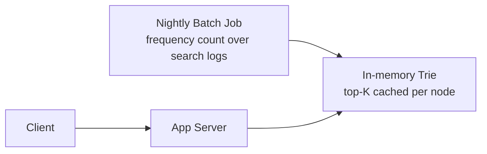
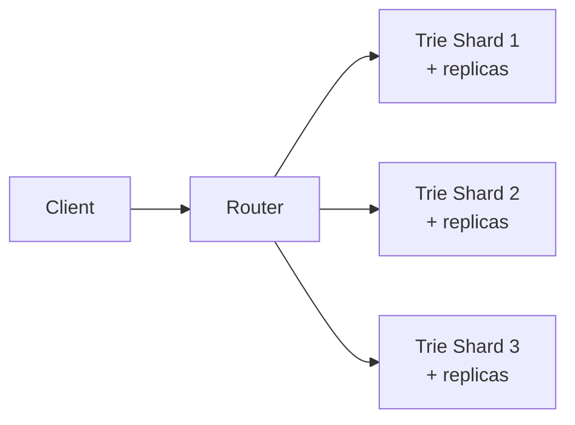
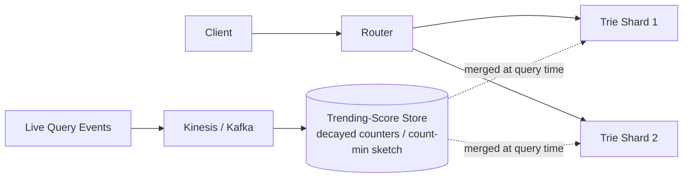
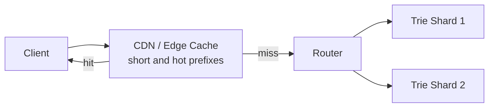
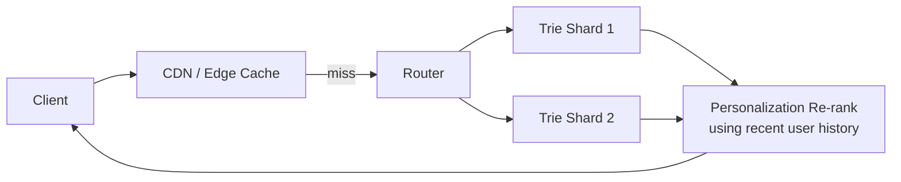

# Typeahead / Autocomplete — HLD

Reported directly in Amazon interviews as "design a typeahead box for a search
engine" — think the Amazon.com search bar suggesting completions as you type. It's a
compact, data-structure-driven problem (the Trie is the star), but it earns its depth
the same way the rate limiter does: scale, freshness, and availability follow-ups keep
it going the whole session.

---

## Q&A: Functional Requirements

**Q: What must the system do?**

- Given the prefix a user has typed so far, return up to `K` ranked suggestions in
  real time, updating as they keep typing.
- Suggestions should be relevant — ranked by popularity and/or personalization — and
  reasonably fresh: a genuinely trending query should surface quickly, not only
  historically popular ones.
- (Nice-to-have) Typo tolerance and multi-language support.

---

## Q&A: Non-Functional Requirements

**Q: What quality attributes actually matter here?**

- **Extremely low latency** — this has to feel instant while the user is actively
  typing. Round-trip budget is well under 100ms end-to-end.
- **Very high QPS** — a request can fire on nearly every keystroke, so effective load
  is a large multiple of "one search per user action."
- **High availability** — a slow or down typeahead should never block the user from
  just hitting enter and searching normally.
- **Scalability** — hundreds of millions of distinct historical query strings at
  Amazon's scale.
- **Freshness** — a breaking/trending query (today's big product launch) should
  surface within minutes, not after the next nightly batch job.

---

## Q&A: Core Entities

| Entity | Meaning |
|---|---|
| `Term` | A query string in the vocabulary |
| `Frequency` / popularity score | How often a term has been searched, used for ranking |
| Trie node | A node in the prefix tree, caching its own top-K completions |
| `PersonalizationContext` (optional) | A user's own recent searches, used to re-rank |

---

## Q&A: API Design

```http
GET /v1/autocomplete?prefix=air&limit=10&userId=U123
```

`userId` is optional — present only when personalized re-ranking is enabled.

Response:
```json
{
  "prefix": "air",
  "suggestions": [
    { "text": "airpods", "score": 0.98 },
    { "text": "air fryer", "score": 0.95 },
    { "text": "air conditioner", "score": 0.89 }
  ]
}
```

---

## HLD Walkthrough — Built Incrementally

### Step 1 — Naive linear scan



The client sends the full prefix on every keystroke; the server does
`for each known query: if startsWith(prefix)` and returns the top `K` by static
popularity.

**Q: What's wrong with this?**

An `O(n)` scan over the entire query vocabulary on literally every keystroke isn't
close to fast enough at real scale and QPS — with hundreds of millions of query
strings and requests firing per keystroke, this falls over immediately.

### Step 2 — In-memory Trie on a single server



Build a **Trie** (prefix tree) where each node caches its own top-`K` most popular
completions, so a lookup is `O(prefix length)`, not `O(vocabulary size)`.

**Q: What's the win, and what's still missing?**

Big latency win from the data structure change alone. But the data still lives on a
single server — a single point of failure and a hard memory ceiling — and popularity
is static: built from what data, updated how often? Unanswered so far.

### Step 3 — Precompute the Trie offline from query logs

**Q: Where does the popularity data actually come from?**

A nightly batch job scans historical search logs, counts frequency per query string,
and builds the weighted Trie, with each node's top-`K` completions precomputed.



**Q: What's wrong now?**

Two problems. It's up to a full day stale — it can't reflect a real-time
trending/breaking query, like a big product launch happening right now. And a single
server holding the entire Trie is still both a SPOF and a scaling ceiling as the
vocabulary grows toward Amazon's catalog scale.

### Step 4 — Shard the Trie



**Q: How do you scale past one server's memory and throughput ceiling?**

Partition the Trie across multiple servers — e.g. by the first `N` characters of the
prefix, or by a hash bucket — with a stateless routing layer in front. Replicate each
shard for both availability and read-scaling, the same shard-plus-replica pattern
used for the shared counter store in
[`02_Rate_Limiter.md`](02_Rate_Limiter.md).

### Step 5 — Add a real-time trending signal

**Q: How do you surface a breaking/trending query within minutes, not a full day
later?**

Stream recent search-query events (Kinesis/Kafka) into a fast-updating counter
structure — a decayed/windowed counter in Redis, or a count-min sketch for memory
efficiency at huge cardinality — that gets **merged** with the offline Trie's static
popularity score at query time. This is a weighted blend, not a full replacement:
offline popularity still anchors the ranking, the real-time signal nudges it.



### Step 6 — Edge caching for extremely common prefixes

**Q: A one- or two-letter prefix like "a" or "ai" gets hammered constantly and barely
changes minute to minute. Do you really want every one of those round-tripping to the
Trie shards?**

No — cache these at the CDN/edge layer, shaving off even the round-trip to the Trie
shards for the highest-volume subset of traffic.



### Step 7 — (Optional) Personalization

**Q: Should each user get their own Trie built from their own search history?**

No — far too expensive at this scale (hundreds of millions of users, each needing
their own structure kept warm). Instead, blend in a user's own recent search history
as a lightweight **re-rank** on top of the shared global results returned from the
sharded Trie, rather than maintaining a full separate per-user Trie.



---

## Deep Dives (Q&A)

**Q: Why a Trie specifically, and not an inverted index or a suffix array?**

A Trie is naturally suited to "starts-with" prefix queries — lookup is
`O(prefix length)`, and pre-caching the top-`K` at each node avoids re-ranking
children at query time. Inverted indexes and suffix arrays are built for a different
query shape — full-text/substring search anywhere in a string — which is more
powerful than needed here and correspondingly more expensive for this specific
access pattern.

**Q: How do you keep suggestions appropriate/filtered?**

A blocklist layer applied at index-build time (offensive/banned terms never make it
into the Trie at all) and/or at query time (a final filter pass before returning
results, catching anything the build-time pass missed or anything added to the
blocklist since the last rebuild).

**Q: Typo tolerance — why isn't this just always on?**

Edit-distance/fuzzy matching is much costlier than exact-prefix Trie lookup, so it's
usually a separate, more expensive path rather than living on the hot per-keystroke
path. Typically it's only invoked as a fallback when the exact-prefix path returns
too few results — most keystrokes get the cheap exact path; only the rare
likely-typo case pays for fuzzy matching.

**Q: Why does the client not fire a request on every single keystroke?**

Client-side **debouncing** — wait a short window (tens of milliseconds) after the
last keystroke before firing, rather than firing on each one. This trades a small,
imperceptible perceived-latency delay for a real reduction in backend QPS and wasted
work (a user typing "airpods" fast shouldn't generate seven separate round trips when
only the last one matters).

**Q: How do you rebuild/update the Trie without downtime?**

Build the new version offline / in the background from the latest query logs, then
**atomically swap a pointer/version reference** to the new structure rather than
mutating the live structure in place — readers always see either the fully-old or
the fully-new Trie, never a half-built one.

---

## Common Questions Asked

**Q: Why not just query the primary search index directly for every keystroke?**
A: Far too expensive per-keystroke — a full search-index query is built for
relevance ranking over the whole catalog, not sub-millisecond prefix completion. The
Trie is a purpose-built, much cheaper structure for this specific access pattern.

**Q: How do you handle multi-word queries?**
A: Two common approaches: index by the remaining string after the last space (so
"air fryer ac" completes on "ac"), or maintain a word-level Trie that completes
whole words/phrases. Either is a reasonable answer; state which you're picking and
why.

**Q: What about memory footprint at scale, and why cache only the top-K per node
instead of all descendants?**
A: Caching every descendant's rank at every node would blow up memory (effectively
`O(vocabulary size × depth)`). Capping each node at its own top-`K` keeps memory
bounded and roughly proportional to the number of Trie nodes, independent of how
popular the deepest branches get.

---

## Trade-offs Considered

| Decision | Benefit | Cost |
|---|---|---|
| Trie vs. linear scan vs. inverted index | Trie gives O(prefix length) lookup, purpose-built for "starts-with" | Inverted index/suffix array needed instead if substring (not just prefix) search is required |
| Offline-only popularity vs. blended real-time trending | Blended surfaces breaking trends within minutes | Added streaming/merge complexity vs. a purely static nightly build |
| Sharding by prefix-range vs. by hash | Prefix-range keeps related prefixes together, hash spreads load evenly | Prefix-range risks hot shards (e.g. everything starting with "a"); hash loses locality |
| Personalization depth vs. serving cost | Per-user re-rank improves relevance | Full per-user Tries would be far too costly at this scale |

---

## Alternative Approaches / Technologies

| Component | Primary choice | Alternatives | When to reach for the alternative |
|---|---|---|---|
| Trending-signal store | Redis with decayed counters | Count-min sketch | Count-min sketch once cardinality of tracked terms gets too large for exact per-key counters to fit in memory |
| Streaming platform | Kinesis | Kafka | Kafka if already standardized elsewhere in the org |
| Edge caching | CloudFront (AWS-native default) | Other CDNs | Rarely — mostly an org-standardization choice, not a technical one |
| Whole approach | Hand-rolled Trie service | Managed search product's built-in completion suggester (e.g. OpenSearch/Elasticsearch) | A genuine "build vs. buy" call — worth naming explicitly: a managed suggester is faster to stand up and good enough for many cases, a hand-rolled Trie service wins when you need tight control over ranking blend, latency, or memory footprint at extreme scale |

---

## Takeaway — Interview Cheat Sheet

- Build order: linear scan → in-memory Trie (fixes the algorithmic complexity) →
  build it from real query logs offline → shard + replicate (fixes SPOF and scale) →
  blend in a real-time trending signal via streaming (fixes staleness) → edge-cache
  the hottest short prefixes (fixes cost) → optional lightweight personalization
  re-rank (avoids per-user Tries).
- The core insight: this whole problem is about turning an `O(vocabulary)` operation
  into an `O(prefix length)` one via the Trie, then layering **scale** (sharding),
  **freshness** (streaming trend signal), and **cost control** (edge caching, no
  full per-user Tries) on top of that one core data-structure decision.
- Know the "why a Trie" justification cold — it's the most likely opening question,
  and the pre-cached-top-K-per-node detail is what separates a strong answer from a
  vague one.
