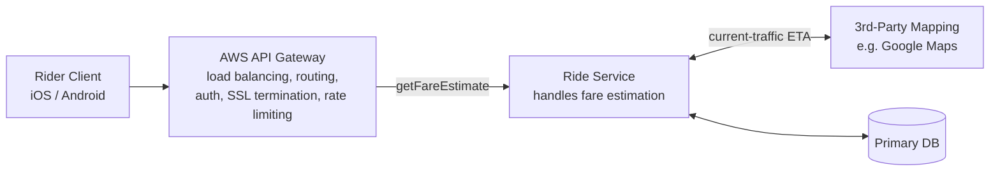
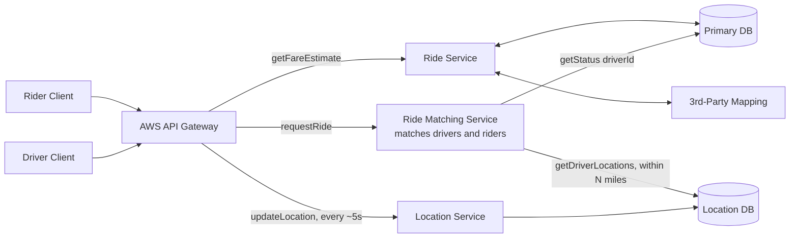
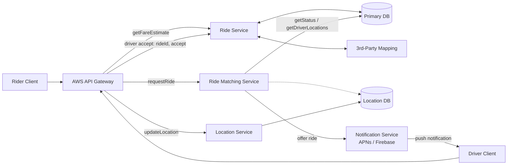
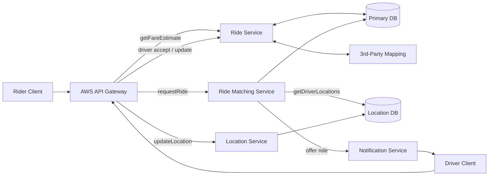
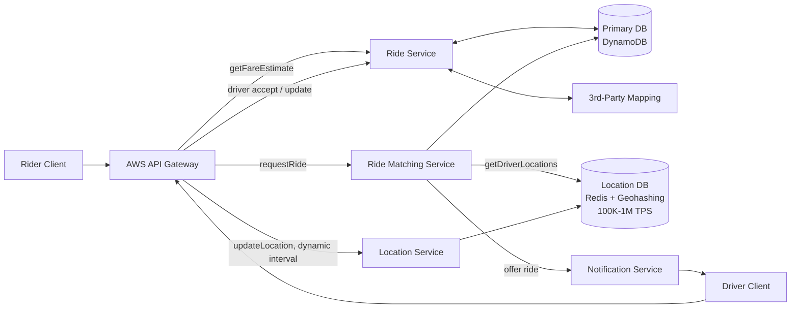
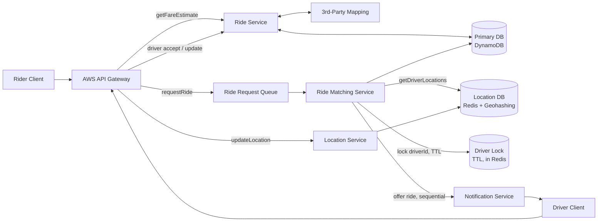

# Design Uber — HLD (Q&A Format)

Source: [Design Uber — System Design Interview breakdown](https://www.youtube.com/watch?v=lsKU38RKQSo)
(Hello Interview). Notes below follow the video's own structure and diagrams. This
is asked heavily at Amazon, Google, and Meta, and it's the reference
proximity-search problem — nail this one and Yelp / Find My Friends / similar
problems become variations on the same core ideas (pairs well with
[06_Typeahead_Autocomplete.md](06_Typeahead_Autocomplete.md) in this folder, which
also leans on a real-time signal + spatial/prefix index combo).

Written in **Q&A format on purpose** — the goal is to be able to fire through this as
rapid-recall drilling before an interview, not just read it once.

> ⚠️ **One section is flagged as inference, not direct transcript**: the video's
> transcript I was given cuts off right as it explains the `Ride Request Queue`
> component. That one answer is marked clearly below — everything else is drawn
> directly from the video's narration and its two whiteboard diagrams.

---

## The Roadmap (presenter's recommended structure for any user-facing system)

**Q: What's the recommended order of sections for a system design interview like this one?**

A: 1) **Requirements** (functional + non-functional) → 2) **Core Entities + API** →
3) **High-Level Design** (goal: satisfy the functional requirements, nothing more)
→ 4) **Deep Dives** (goal: satisfy the non-functional requirements). Each section
builds on the one before it — the HLD is just "walk through the APIs one by one and
build whatever's needed to satisfy each," and the deep dives are just "walk through
the NFRs one by one and go fix whatever doesn't yet satisfy them."

---

## Functional Requirements

**Q: What are the three core functional requirements for Uber?**

A:
1. Users should be able to input a start location and a destination and get an
   **estimated fare**.
2. Users should be able to **request a ride** and be matched with a nearby available
   driver in real time.
3. Drivers should be able to **accept or deny** a ride request, then **navigate**
   first to pickup and then to dropoff.

**Q: What did the presenter explicitly mark out of scope, and why does that matter?**

A: Multiple car types (just "Uber X" for this design), ratings for drivers/riders,
and scheduling a ride in advance. It matters because **staying focused is itself a
signal** — interviews move fast (~35 minutes of real content), and a candidate who
clearly scopes down to 3 core features and explicitly parks the rest shows product
judgment, not just technical breadth.

---

## Non-Functional Requirements

**Q: What are the four NFRs that matter most here, and how is each one quantified in
the context of *this specific system* (not just named as a buzzword)?**

A:
- **Low-latency matching** — under 1 minute to match, or fail gracefully (tell the
  user no drivers are available).
- **Consistency of matching** — a ride must map to exactly one driver, 1:1, ever.
  Framed via CAP: for the *matching* operation specifically, consistency is
  prioritized over availability (partition tolerance is a given).
- **High availability** — everywhere *outside* the matching process itself. Minimal
  downtime, always able to serve requests.
- **High throughput** — must absorb surges (stadium events, New Year's Eve),
  estimated at hundreds of thousands of requests within a single region.

**Q: Why does the presenter insist on quantifying and contextualizing NFRs instead of
just listing "scalability, availability, consistency"?**

A: Because the NFRs are **what drive the deep dives later** — a vague buzzword list
gives you nothing to design against. "Low latency" means nothing on its own; "under 1
minute to match, or fail" tells you exactly what to build and test against.

**Q: What did the presenter explicitly skip, and why?**

A: GDPR/privacy, resilience/failure handling, monitoring/logging/alerting, and
deployment/CI-CD — all reasonable things to mention exist, but not the focus of this
particular 35-minute design.

**Q: Should you do back-of-the-envelope math (DAU, storage, bandwidth) right after
writing the NFRs, like most candidates do?**

A: **No — this is one of the video's strongest opinions.** Early back-of-envelope
math almost always concludes "yeap, it's a lot, we'll need horizontal scaling" — a
conclusion you already knew before doing the math. It burns real interview time for
zero signal. Instead: **do estimation later, exactly when a specific number will
directly change a design decision** (this video does it once, mid-deep-dive, to
justify swapping databases — see the 600K TPS calculation below). Tell your
interviewer this is your plan up front; almost everyone agrees.

---

## Core Entities

**Q: What are the core entities, and how is this different from a full data schema?**

A: `Ride`, `Driver`, `Rider`, `Location`. This is deliberately *not* a full schema —
it's too early to know every field. The entities just name "what objects flow through
and get persisted in the system." The exact fields get filled in progressively during
the HLD, each time a flow actually lands on the database (you'll see this happen
below).

---

## API Design

**Q: What's the fare-estimate endpoint?**

A:
```
POST /fare/estimate
Body: { source, destination }
Returns: Partial<Ride> { id, ETA, price }
```

**Q: What's the request-ride endpoint, and why PATCH?**

A:
```
PATCH /ride/request
Body: { rideId }
Returns: 200 / 400
```
`PATCH` because it's updating the same `Ride` row created by the fare-estimate call
(`PUT` would also be defensible — the presenter notes not to get hung up on this
choice). The response is just an ack — actual matching happens **asynchronously**,
which is exactly why the "under 1 minute" NFR exists as a distinct, testable target.

**Q: How does the system know where drivers currently are?**

A: An endpoint drivers call periodically with their position:
```
POST /location/update
Body: { driverId, lat, long }
```
The presenter flags this as something candidates commonly forget to spec up front —
totally fine to discover it mid-HLD and circle back, which is what happens below too.

**Q: What's the driver-accept endpoint?**

A:
```
PATCH /ride/driver/accept
Body: { rideId, accept: boolean }
```

**Q: What's the driver-navigation-update endpoint?**

A:
```
PATCH /ride/driver/update
Body: { rideId, status }
Returns: { lat, long } of the next destination, or null if there's nowhere further
to go
```
E.g. driver marks "arrived at pickup" → server flips status and returns the
destination's coordinates; driver marks "arrived at destination" → server returns
`null`, ride is complete.

**Q: Why does none of this API include explicit data types (`number`, `string`,
etc.)?**

A: **Presenter's tip, senior+ specifically:** spelling out obvious types wastes time
and can come across as unnecessary hand-holding — the interviewer already knows a
latitude is a number. Only annotate something genuinely non-obvious, like a custom
enum (`status: "fare-estimated" | "matched" | ...`). Junior/mid-level candidates:
feel free to keep the types, it's not held against you at that level.

**Q: Why isn't `userId` or `driverId` ever passed in a request body?**

A: **Security.** It comes from the session/JWT in the request **header**, never the
body. If it were in the body, any authenticated client could impersonate another user
by simply substituting a different ID — this is worth a one-line callout to the
interviewer even if you don't diagram it.

---

## High-Level Design — Built Incrementally

The video builds this up by walking through the APIs one at a time and adding
exactly what's needed to satisfy each — the same "grow the diagram one capability at
a time" approach used throughout this folder.

### Step 1 — Fare estimate



**Q: How does the Ride Service actually compute a fare?**

A: The presenter deliberately avoids building a custom ML pricing model — call out a
third-party mapping API (Google Maps-style) for a traffic-aware ETA, then derive
price from that ETA with a simple formula. **Explicitly say you're simplifying this
on purpose** rather than silently hand-waving it; that's the signal, not the
sophistication of the pricing model itself.

**Q: What does the `Ride` row look like after this step?**

A: `Ride { id, riderId, fare, ETA, source, destination, status: "fare-estimated" }`
— note the schema is being built field-by-field, exactly as each flow lands on the
database, not written out fully in advance.

### Step 2 — Request ride, find nearby drivers, keep locations fresh



**Q: Why is Ride Matching a *separate* microservice from Ride Service, instead of
handling matching inside the same service that does fare estimation?**

A: They're fundamentally different workloads — matching is far more computationally
expensive and inherently **asynchronous**, while fare estimation is a quick
synchronous call. Splitting them lets each **scale independently** and be **owned by
separate teams**.

**Q: How does matching actually find candidate drivers?**

A: `getDriverLocations()` against the Location DB, scoped to some radius (e.g. "all
drivers within N miles"), then `getStatus(driverId)` against the Primary DB to filter
that candidate list down to drivers whose status is `available` (excluding
`in_ride`/`offline`).

**Q: What does the `Driver` row look like?**

A: `Driver { id, ...metadata (car, license plate, photo), status: "in_ride" |
"offline" | "available" }`.

### Step 3 — Offer the ride, driver accepts



**Q: How does the Ride Matching Service actually notify a candidate driver?**

A: Via a **Notification Service** — treated as a black box in this design (it's a
whole separate interview question on its own; the presenter name-checks this
explicitly). Concretely: APNs for iOS, Firebase for Android — native push
notifications asking "accept this ride?"

**Q: What happens on accept?**

A: The driver's app calls `PATCH /ride/driver/accept`, which hits the Ride Service
and updates the `Ride` row: sets `driverId` (previously unset/optional) and flips
`status` to something like `matched`.

### Step 4 — Navigation (final FR-complete design)


*(This matches the video's first full whiteboard state — screenshot 1.)*

**Q: How does the driver know where to go next, step by step?**

A: The driver calls `PATCH /ride/driver/update` with their new status (e.g. "arrived
at pickup") — the server updates the `Ride` row and returns the lat/long of wherever
they need to go next (destination after pickup, `null` after dropoff — ride
complete).

**Q: Does this design satisfy the functional requirements?**

A: Yes, all three — fare estimate ✅, request + real-time matching ✅, accept/deny +
navigate ✅. It does **not** yet satisfy any of the NFRs (matching speed, matching
consistency, availability, throughput) — that's the entire point of the deep dives
that follow. The presenter is explicit that this is the expected checkpoint: a clean,
simple design that works, with known gaps still open.

**Q: How much of the interview clock should this take?**

A: Target ~15 minutes in for a senior/staff candidate (a bit more, ~15-20, is fine for
mid-level) to have Requirements + Entities/API + this HLD done, leaving the remaining
time for deep dives.

---

## Deep Dive 1 — Low-Latency Matching (the Location Service)

**Q: Which NFR is this deep dive targeting?**

A: Low-latency matching (<1 min) — specifically the *location* piece: finding
"drivers near me" fast, while ingesting a huge, continuous stream of location
updates.

**Q: What's the actual throughput number, and how is it derived (this is the point
where the video finally does back-of-envelope math — because it's about to directly
change the design)?**

A: ~6M total drivers → assume ~3M active at once → each sends a location update every
~5 seconds → **3,000,000 / 5 = 600,000 updates/second.**

**Q: Why not just use PostgreSQL with `lat`/`long` columns and a range query?**

A: Three real problems:
1. B-tree indexes are built for **1-dimensional** data; `lat`/`long` is inherently
   2D, so a plain index barely helps — slow, poorly-optimized queries.
2. A wide radius search (say 20 miles) still means scanning a large number of rows.
3. Throughput: vanilla Postgres tops out around **2-4K TPS** — nowhere close to the
   600K/sec required.

**Q: If sticking with Postgres, how do you fix the *query-speed* half of the
problem?**

A: Add a geospatial index — a **Quad Tree**, via Postgres's `PostGIS` extension.

**Q: How does a Quad Tree work?**

A: Recursively split the map into 4 quadrants. If a quadrant's driver count exceeds
some threshold `K`, split *that* quadrant into 4 more, and repeat. A lookup just
walks down the tree to the target region's leaf node, which holds a small, bounded
list of drivers.

**Q: Does a Quad Tree fix the *throughput* half of the problem too?**

A: No — you'd still need a **queue** in front of Postgres to batch 600K/sec worth of
writes down toward its ~4K TPS ceiling. That introduces its own problems: added
latency (driver positions go stale while a batch fills up), and every batch write
forces re-indexing a chunk of the quad tree — expensive and memory-heavy. Workable
for a mid-level answer; not a strong one.

**Q: What's the actually good answer?**

A: Swap the store entirely — use **Redis** (in-memory, handles ~100K–1M TPS in a
well-tuned cluster) combined with Redis's native support for **Geohashing** instead
of a quad tree.

**Q: How does Geohashing work, and how is it fundamentally different from a Quad
Tree?**

A: Also recursively splits the map into quadrants — but **unconditionally**, not
based on density, down to a chosen precision, encoding the path as a **base-32
string** (longer string = more precise cell). Critically, it needs **no separate
index data structure to maintain** — a geohash is just a string, cheap to compute and
directly storable.

**Q: When do you reach for a Quad Tree vs. Geohashing in an interview — what's the
actual decision rule?**

A:
- **Quad Tree** — better when location **density is uneven** (Yelp: dense NYC, empty
  mid-ocean) **and** updates are **infrequent** (reindex cost is a non-issue).
- **Geohashing** — indifferent to density, but far better suited to **high-frequency
  writes** (no reindex step at all). This is Uber's exact profile — 600K writes/sec —
  which is why geohashing wins here even though driver density is itself uneven.

This same quad-tree-vs-geohash framing generalizes to essentially every
proximity-search interview (Yelp, Find My Friends, this one) — know it cold.

**Q: Is this literally what Uber uses in production?**

A: Close, not exact — Uber built an in-house system (**H3**) using **hexagons**
instead of squares, which fixes a real geometric issue: with square cells, the
distance from center-to-edge isn't the same as center-to-corner, so proximity search
on squares is subtly non-circular/less accurate. Naming H3 is a nice depth signal if
you want to go further than the interview strictly requires.

**Q: With Redis + Geohashing in place, do we still need that write-batching queue?**

A: No — Redis alone can absorb 600K TPS directly. Keeping the queue at this point
would be **over-engineering**; remove it.

**Q: 600K TPS still sounds like a lot — how would you bring it down further, if the
interviewer pushes on it?**

A: Two options, in increasing sophistication:
1. **Simple:** relax the fixed update interval (10s, 20s, up to a minute) — a
   straightforward accuracy-vs-load product tradeoff.
2. **Better — dynamic/adaptive updates, decided client-side:** skip sending updates
   when the driver isn't accepting rides, is stationary/parked, or is in a
   low-demand area; send more frequently in hot zones or near an active request. This
   is the stronger, senior/staff-flavored answer because it ties the technical
   decision back to product signal instead of a single global constant.



---

## Deep Dive 2 — Consistency of Matching

**Q: Which NFR is this deep dive targeting?**

A: Consistency of matching — a ride must end up matched to **exactly one** driver,
and a driver must never be holding more than one active ride offer at a time.

**Q: What are the two separate invariants this actually breaks down into?**

A:
1. **Don't send more than one active ride request out for a given ride at a time.**
2. **Don't send more than one active ride request to a given driver at a time.**

Two different invariants, solved with two different, simple mechanisms — not one
big one.

**Q: How is invariant #1 (one active request per *ride*) enforced?**

A: **Sequential, not parallel, offering.** The Ride Matching Service walks its list
of eligible nearby drivers **one at a time** in a loop — offer the next candidate,
wait a fixed timeout (e.g. 10 seconds), and only advance to the next candidate on
decline or timeout. Because only one driver is ever "live" for a given ride at any
instant, two drivers can never accept the same ride simultaneously — there's nothing
to race.

```java
while (noMatch) {
    driver = nextDriver();
    lock(driver);
    sendNotification(driver);
    wait(10s);
}
```

**Q: How is invariant #2 (one active request per *driver*) enforced?**

A: A short-lived **distributed lock on the driver**, keyed by `driverId`, with a
**TTL** — held in Redis right alongside the location data (`Driver Lock (TTL) —
driverId` in the video's diagram). When a driver is offered a ride, the matching
service locks them for the offer window; any other matching process that tries to
offer that same driver a *different* ride at the same time sees the lock and skips
them.

**Q: Why does the lock need a TTL specifically, instead of just locking and
unlocking normally?**

A: Safety against failure. If the matching service crashes mid-offer, or the driver's
app never responds, a lock without a TTL would strand that driver **locked forever**
— never offerable again. The TTL guarantees the lock self-expires and the driver
becomes offerable again automatically, no manual cleanup required.

**Q: What's the `Ride Request Queue` component that appears in the video's second
diagram, sitting between the API Gateway and the Ride Matching Service?**

> ⚠️ **Inference, not direct transcript** — the provided video transcript cuts off
> right before this component is explained on-screen. The reasoning below is my best
> inference from the diagram plus the stated NFRs, not a direct quote from the video.
> If you want the presenter's actual framing, paste the remaining transcript segment
> covering this part and I'll correct this section.

A: Most likely purpose, given the "handle surges — hundreds of thousands of requests
in a region" throughput NFR from earlier: it absorbs bursty `requestRide()` traffic
(a stadium letting out, a big event ending) so the Ride Matching Service — which does
real, sequential, per-ride matching work and therefore has a bounded processing rate
— can **drain the queue at a sustainable pace** instead of being hit synchronously by
every spike. This is the same "decouple ingestion from processing" shape used for
[the Notification System's queue-based fan-out](03_Notification_System.md) in this
folder.


*(This matches the video's second whiteboard state — screenshot 2.)*

---

## Depth Expectations by Level (presenter's framing)

**Q: How many places should you "go deep," and how deep, based on your target
level?**

A:
- **Mid-level** — the plain HLD above (before either deep dive) is already close to
  a passing bar. You should still be able to answer follow-up probes reasonably
  (matching consistency, scaling the location DB) even if you don't lead with them
  unprompted.
- **Senior** — go deep in **~2 places**. This note's two deep dives (location/
  geospatial indexing, and matching consistency) are exactly that shape.
- **Staff** — go deep in **~3 places**, and deeper still in each. A strong staff
  signal is genuinely teaching the interviewer something — e.g. bringing real
  hands-on DynamoDB or Redis-at-scale experience into the discussion, not just
  reciting the tradeoffs.

---

## Interview Cheat Sheet

- **Roadmap**: Requirements (FR/NFR) → Core Entities/API → HLD (satisfy FRs only) →
  Deep Dives (satisfy NFRs only). Don't blend these — each stage has one job.
- **Skip reflexive back-of-envelope math.** Do it later, exactly when a number will
  change a decision (here: the 600K TPS figure directly justifies ditching
  Postgres).
- **Quad Tree vs. Geohashing** is the single most reusable piece of knowledge in this
  whole design — it resolves almost every proximity-search interview (Uber, Yelp,
  Find My Friends). Quad Tree = uneven density + low write frequency. Geohashing =
  density-indifferent + high write frequency.
- **Consistency of matching splits into two separate invariants** — one active offer
  per ride (sequential offering) and one active offer per driver (TTL'd distributed
  lock). Don't try to solve both with one mechanism.
- No data types in the API spec, IDs come from the JWT/session header not the
  request body — small details, but they read as senior-level polish.

---

## Sources

- ["Design Uber w/ an Ex-Meta Staff Engineer: System Design Interview breakdown"](https://www.youtube.com/watch?v=lsKU38RKQSo) — Hello Interview (YouTube)
- Hello Interview's written breakdown of the same problem (referenced in the video; not directly fetched for these notes)
