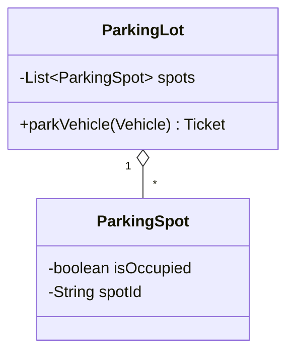
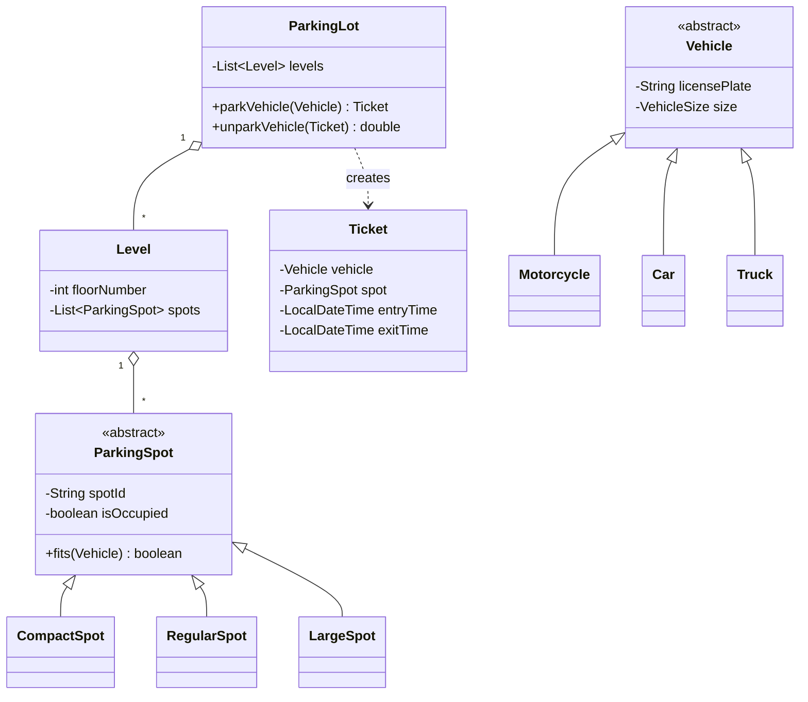
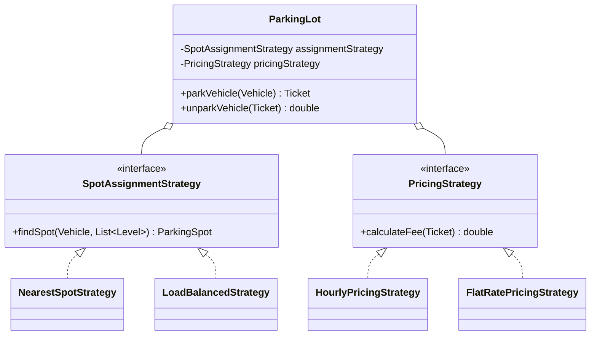

# Parking Lot — LLD

The **single most universally reported** OOD problem — at Amazon and everywhere
else. It looks trivial on the surface, which is exactly the trap: at L4 it's
"model a lot, some spots, some cars." At L5+, Amazon-specific question banks
explicitly call out the **multi-threaded variant** — several entry gates
assigning spots to arriving cars *at the same time*, and now the "simple"
class-design problem is really a concurrency problem wearing an OOD costume.

---

## Clarifying Questions to Ask First

Ambiguity here is deliberate — asking these signals seniority before you write a
single class:

- Is this a **single level or multi-level** lot? (Multi-level adds a `Level`
  entity and a "which level has space" decision.)
- What **vehicle types** does it support — car, motorcycle, truck/bus? Do
  different types need different **spot sizes** (compact/large/handicap/EV)?
- Is there a **payment/pricing** requirement (hourly rate, flat fee, monthly
  pass), or is parking free and the focus is purely spot allocation?
- **How many entry/exit gates**, and can vehicles enter concurrently at more
  than one? (This is the question that decides whether concurrency is in scope
  at all.)
- Do we need **reservations** ahead of time, or only walk-in assignment?
- Is there a **capacity/display requirement** — e.g. a "lot full" sign per
  level, updated live?

For this note, assume: multi-level, three vehicle types (Motorcycle/Car/Truck)
mapped to three spot sizes (Compact/Regular/Large), hourly pricing, multiple
concurrent entry gates, no reservations (walk-in only) — this is the shape
Amazon-specific question banks describe as the "multi-threaded Parking Lot."

---

## Requirements

**Functional**
- Assign an available, correctly-sized spot to an arriving vehicle.
- Issue a `Ticket` recording vehicle, spot, and entry time.
- On exit, compute the fee from entry time to exit time and free the spot.
- Report availability (free spots by level/type).

**Non-Functional**
- **Correctness under concurrency** is the headline NFR: two gates must never
  assign the same physical spot to two different vehicles.
- Spot lookup/assignment should be fast — no scanning every spot in the lot on
  every arrival once the lot has thousands of spots.
- Easy to extend with new vehicle/spot types or a new pricing scheme without
  touching existing classes (this is the Open/Closed Principle framing the
  interviewer is listening for).

---

## Core Objects (the Nouns)

```text
ParkingLot        -- top-level coordinator; holds Levels
Level             -- holds ParkingSpots
ParkingSpot        -- abstract; subclasses: CompactSpot, RegularSpot, LargeSpot
Vehicle            -- abstract; subclasses: Motorcycle, Car, Truck
Ticket             -- vehicle + spot + entryTime (+ exitTime, fee once paid)
Gate (Entry/Exit)  -- where a vehicle interacts with the system
SpotAssignmentStrategy -- pluggable "which free spot do we give this vehicle" logic
PricingStrategy    -- pluggable "how much does this ticket cost" logic
```

---

## Class Diagram — Built Incrementally

### Step 1 — Bare minimum: one lot, one list of spots



**What's missing?** Every spot is identical, but real lots have different sizes
for different vehicles — a motorcycle shouldn't take a large spot meant for a
truck. Need a type hierarchy on both sides.

### Step 2 — Add vehicle and spot types, and a Ticket



**What's missing?** `parkVehicle` needs to pick *which* free spot to hand out —
right now that logic has nowhere clean to live except a big `if/else` buried
inside `ParkingLot`, which is exactly the kind of hardcoded branching that gets
painful the moment a second allocation rule shows up (e.g. "prefer the lowest
floor" vs. "load-balance across floors").

### Step 3 — Extract spot assignment into a Strategy, add pricing



This is the final shape referenced by the code skeleton below.

---

## Design Patterns Applied (Q&A)

**Q: Why Strategy for spot assignment and pricing, instead of a method with
branching logic?**

Because both are things the business will change independently of the core
parking flow: today it's "nearest spot," tomorrow it's "load-balance across
levels to reduce hot floors," or a promo adds "first hour free." If that logic
lives inside `ParkingLot`, every change means editing and re-testing the class
that does the actual parking. Strategy isolates "which spot" and "how much" as
swappable, independently-testable objects — `ParkingLot` just delegates.

**Q: Where does Singleton actually fit, and what's the catch?**

`ParkingLot` itself is a natural Singleton candidate — there's physically one
lot, and multiple `ParkingLot` instances managing the same physical spots would
be a correctness bug, not just bad style. The catch to say out loud
unprompted: Singleton makes unit testing harder (global mutable state, hard to
reset between tests) and doesn't scale to "the same class also manages a second
physical lot across town." A safer version: keep `ParkingLot` a normal class,
and let whatever wires up the application (a single composition root) guarantee
only one instance is constructed — dependency injection achieves the same
uniqueness guarantee without baking `getInstance()` into the class itself.

**Q: Any use for Observer here?**
Yes — a "lot full" or "spots available" display board is a textbook Observer:
`ParkingLot` publishes occupancy-changed events, and one or more `DisplayBoard`
observers re-render without `ParkingLot` needing to know displays exist at all.

---

## Core Code Skeleton (Java)

```java
public abstract class ParkingSpot {
    protected final String spotId;
    protected final AtomicBoolean occupied = new AtomicBoolean(false);

    public abstract boolean fits(Vehicle vehicle);

    // Atomic claim: returns true only if THIS call flipped false -> true.
    // This one line is the entire fix for the "two gates, one spot" race.
    public boolean tryOccupy() {
        return occupied.compareAndSet(false, true);
    }

    public void free() {
        occupied.set(false);
    }
}

public class CompactSpot extends ParkingSpot {
    public boolean fits(Vehicle vehicle) { return vehicle.getSize() == VehicleSize.SMALL; }
}

public abstract class Vehicle {
    protected final String licensePlate;
    protected final VehicleSize size;
    public VehicleSize getSize() { return size; }
}

public interface SpotAssignmentStrategy {
    Optional<ParkingSpot> findSpot(Vehicle vehicle, List<Level> levels);
}

public class NearestSpotStrategy implements SpotAssignmentStrategy {
    public Optional<ParkingSpot> findSpot(Vehicle vehicle, List<Level> levels) {
        for (Level level : levels) {
            for (ParkingSpot spot : level.availableSpotsFor(vehicle)) {
                if (spot.tryOccupy()) return Optional.of(spot); // CAS wins the race, or we try the next candidate
            }
        }
        return Optional.empty();
    }
}

public interface PricingStrategy {
    double calculateFee(Ticket ticket);
}

public class HourlyPricingStrategy implements PricingStrategy {
    private final double ratePerHour;
    public double calculateFee(Ticket ticket) {
        long minutes = Duration.between(ticket.getEntryTime(), ticket.getExitTime()).toMinutes();
        return Math.ceil(minutes / 60.0) * ratePerHour;
    }
}

public class ParkingLot {
    private final List<Level> levels;
    private final SpotAssignmentStrategy assignmentStrategy;
    private final PricingStrategy pricingStrategy;
    private final Map<String, Ticket> activeTickets = new ConcurrentHashMap<>();

    public Ticket parkVehicle(Vehicle vehicle) {
        ParkingSpot spot = assignmentStrategy.findSpot(vehicle, levels)
            .orElseThrow(() -> new LotFullException(vehicle));
        Ticket ticket = new Ticket(vehicle, spot, LocalDateTime.now());
        activeTickets.put(ticket.getId(), ticket);
        return ticket;
    }

    public double unparkVehicle(String ticketId) {
        Ticket ticket = activeTickets.remove(ticketId);
        ticket.setExitTime(LocalDateTime.now());
        double fee = pricingStrategy.calculateFee(ticket);
        ticket.getSpot().free();
        return fee;
    }
}
```

---

## Concurrency Deep Dive

This is *the* follow-up on this problem, and Amazon-specific banks call it out
by name ("Parking Lot — Multi Threaded"). Walk through it as a progression:

**The bug:** two entry gates both see the same `ParkingSpot` as free, both try
to assign it to different vehicles, both succeed — one vehicle physically has
nowhere to park, and the system's data says two vehicles occupy one spot.

**Fix #1 — coarse lock (correct, doesn't scale):** wrap the entire
`findSpot` + `occupy` sequence in a single `synchronized` block on the whole
lot. Simple and obviously correct, but every gate now serializes through one
lock — throughput collapses as gate count grows, exactly the "correctness
without concurrency" trap interviewers want you to name and move past.

**Fix #2 — per-spot atomic claim (what's in the code above):** each
`ParkingSpot` owns its own `AtomicBoolean`, claimed via
`compareAndSet(false, true)`. Two gates can race on *different* spots with zero
contention; if they somehow race on the *same* spot (both see it free in the
same instant), exactly one `compareAndSet` wins and the other gate's strategy
just moves on to the next candidate spot. No lock is ever held while scanning —
only the single-word CAS at the moment of claiming.

**Fix #3 — free-spot pool per type (better at very high gate counts):** instead
of gates scanning a list and CAS-ing spots one by one, maintain a
`ConcurrentLinkedQueue<ParkingSpot>` (or a `BlockingQueue`) of free spots per
size. Assignment becomes a single atomic `poll()` — O(1) instead of a scan, and
the queue itself is the only thing under contention, not N individual spots.
This is the same idea as trading "N locks" for "one well-designed concurrent
data structure" — worth naming as the natural next step if the interviewer
pushes on "what if there are 10,000 spots and 50 gates."

**A subtlety worth stating out loud:** none of this requires a *distributed*
lock as long as the whole lot is managed by one process. The moment this
becomes "a chain of 500 parking garages coordinated centrally," it stops being
an LLD concurrency problem and becomes the HLD partitioning/consistency problem
covered in [`../../HLD/key_value_store_hld_notes.md`](../../HLD/key_value_store_hld_notes.md)
— naming that boundary explicitly is a strong signal you know which tool fits
which layer.

---

## Common Follow-Up Questions

**Q: How do you add EV charging spots that need exclusive, longer-duration use?**
A: A new `EVChargingSpot extends ParkingSpot` with its own `fits()` rule (only
EVs) and its own pricing strategy (e.g. per-kWh instead of per-hour) — zero
changes to `ParkingLot`, `Vehicle`, or existing spot types. This is the
Open/Closed payoff of the design.

**Q: How would you support monthly parkers / reservations?**
A: Add a `Reservation` entity binding a `Vehicle` (or customer) to a specific
spot for a time window; `SpotAssignmentStrategy` needs to check "is this spot
reserved right now" before offering it to a walk-in. This is additive, not a
rewrite.

**Q: What if the lot fills up — how does a vehicle know before driving in?**
A: The Observer-based display board from the patterns section — `ParkingLot`
publishes an occupancy-changed event on every `parkVehicle`/`unparkVehicle`,
and a `DisplayBoard` observer keeps a live per-level free-spot count without
`ParkingLot` needing any awareness that a display exists.

**Q: How do you handle a vehicle that's bigger than expected in a spot rated for
smaller vehicles (e.g. a large SUV squeezed into a compact spot by a human)?**
A: This is a "the model is a simplification of reality" trap — a reasonable
answer is that `fits()` is advisory at assignment time; physical reality can't
be enforced by software, so this is out of scope unless the interviewer
explicitly wants sensor-based occupancy detection, which turns this into an
IoT-integration problem, not a core OOD one.

---

## Trade-offs Considered

| Decision | Benefit | Cost |
|---|---|---|
| Strategy for spot assignment & pricing | New rules added without touching `ParkingLot` | Slightly more classes/indirection up front |
| Singleton `ParkingLot` | Enforces "exactly one lot" at the type level | Harder to unit test, doesn't generalize to multiple lots |
| Per-spot `AtomicBoolean` + CAS | High concurrency, no coarse lock | Assignment strategy still scans candidates (O(spots) worst case) |
| Free-spot queue per type | O(1) assignment even at large scale | Extra bookkeeping to keep the queue in sync with spot state |
| Coarse `synchronized` lock | Simplest to reason about, obviously correct | Serializes all gates — doesn't scale with gate count |

---

## Interview-Ready Summary

> I'd model this with an abstract `Vehicle` and `ParkingSpot` hierarchy so new
> types are additive, and pull spot-assignment and pricing logic out into
> `SpotAssignmentStrategy` and `PricingStrategy` interfaces so those rules can
> change independently of the core parking flow. For concurrency — since
> multiple gates assign spots simultaneously — each spot claims itself
> atomically via compare-and-swap rather than relying on one coarse lock, so
> gates racing on different spots never contend, and a genuine race on the same
> spot resolves to exactly one winner with no double-booking. At very large
> scale I'd trade the per-spot scan for a concurrent free-spot queue per size,
> making assignment O(1) instead of a scan.

---

## Key Concepts to Master

```text
Type hierarchies for extensibility (Vehicle, ParkingSpot subclasses)
Strategy pattern for swappable business rules (assignment, pricing)
Singleton trade-offs -- when it helps vs. when DI is the safer choice
Atomic compare-and-swap as the fix for a check-then-act race condition
Coarse lock -> per-resource lock -> lock-free concurrent structure, as a
  progression to narrate under a concurrency follow-up
Where LLD concurrency stops and HLD distributed coordination starts
```
