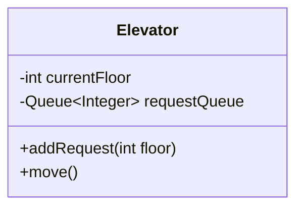
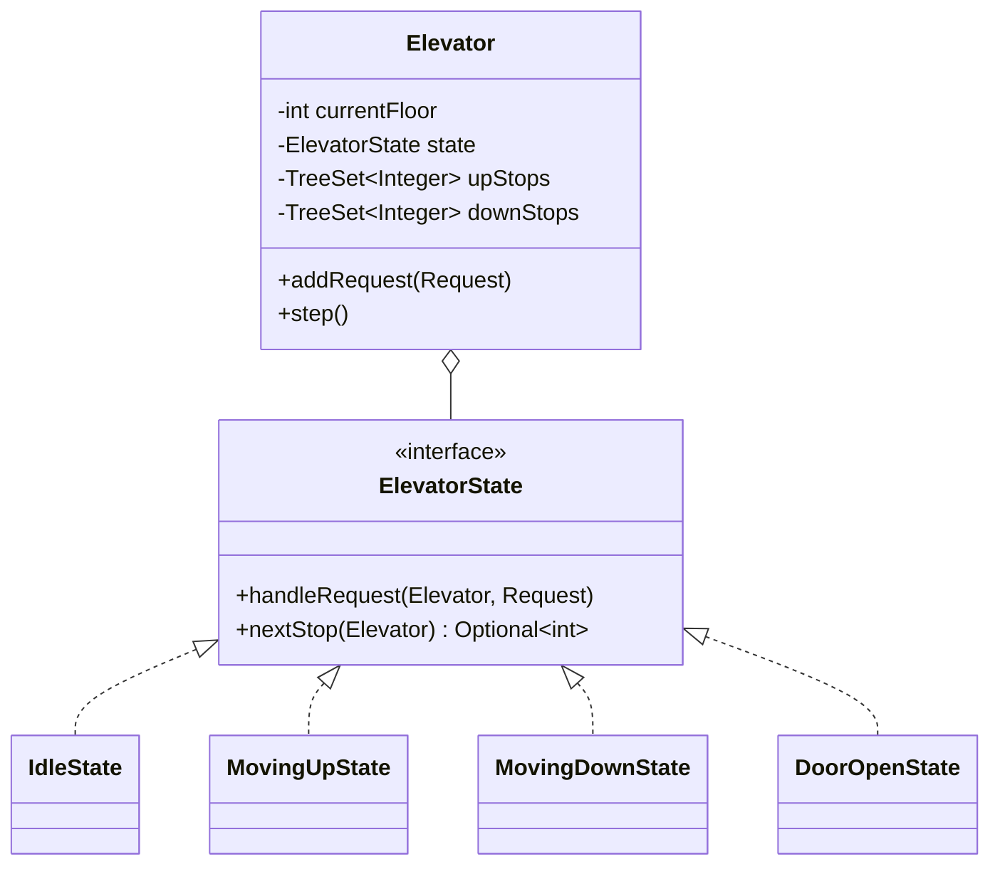
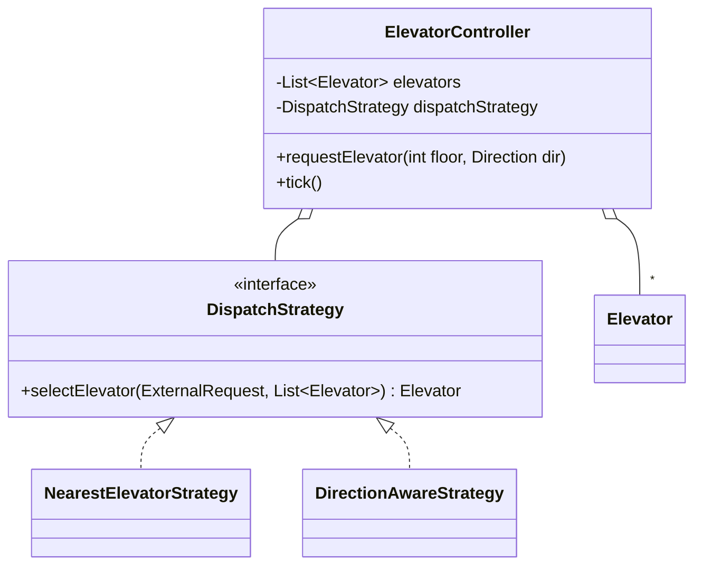

# Elevator System — LLD

Reported as **the hardest of the "classic three"** OOD problems (alongside
Parking Lot and Vending Machine), and for a good reason: it's not just state
tracking. A correct elevator has to make an actual **scheduling decision** —
which elevator answers which call, and in what order does it visit its stops —
and a naive FIFO answer is both wrong and easy for an interviewer to break with
one follow-up ("what if elevator 2 is already going up past that floor?").

---

## Clarifying Questions to Ask First

- **How many elevators and floors?** Single-elevator is a warm-up; multi-elevator
  dispatch is where the real signal is.
- Are requests only the **external call buttons** (floor + direction), or also
  **internal destination buttons** (once inside, pick a floor)? Real systems have
  both, and they're modeled differently.
- Is there a **capacity/weight limit** that can reject a stop?
- Does the interviewer want **optimal** dispatch (minimize total wait time
  across all requests — hard, arguably NP-hard-ish for a real-time system) or a
  **good-enough heuristic** (this is almost always the intended scope)?
- Any need for **priority/express** service, or a maintenance/out-of-service
  mode?

Assume for this note: multiple elevators, both external and internal requests,
a heuristic (not provably optimal) dispatch algorithm — this is the standard
scope Amazon-level interviewers expect.

---

## Requirements

**Functional**
- Accept an external request: `(floor, direction)`.
- Accept an internal request from inside a moving elevator: `(destinationFloor)`.
- Dispatch the request to *some* elevator, and have that elevator eventually
  serve it.
- Each elevator reports its current floor, direction, and door state.

**Non-Functional**
- Reasonable wait time — not FIFO, not "closest elevator only" (both are easy
  to show as suboptimal with a two-line example).
- No missed or duplicated stops under concurrent requests arriving while
  elevators are mid-move.
- Extensible to new elevator behaviors (maintenance mode, express floors)
  without rewriting the dispatch core.

---

## Core Objects (the Nouns)

```text
ElevatorSystem / ElevatorController -- accepts requests, dispatches to elevators
Elevator             -- owns its own request queue, current floor, direction, state
ElevatorState        -- Idle, MovingUp, MovingDown, DoorOpen (State pattern)
Request              -- abstract; ExternalRequest(floor, direction), InternalRequest(destFloor)
Direction             -- UP, DOWN, IDLE
DispatchStrategy      -- pluggable "which elevator gets this external request"
Display               -- per-floor/per-car indicator (Observer)
```

---

## Class Diagram — Built Incrementally

### Step 1 — One elevator, FIFO queue



**What's wrong?** A plain FIFO queue serves requests in arrival order, not
travel order — if requests arrive for floors 5, 1, 3 while sitting at floor 1,
FIFO sends the elevator to 5, then all the way back down to 1, then back up to
3. That's a terrible, obviously-fixable inefficiency any interviewer will poke
at immediately.

### Step 2 — Directional (SCAN-style) request queues, and a real state machine



This is the core trick of the problem: `upStops` and `downStops` are sorted
sets (`TreeSet` in Java gives O(log N) insert and "next stop above/below
current floor" via `higher()`/`lower()`). While moving up, the elevator keeps
consuming `upStops` in increasing order — exactly like the **SCAN/LOOK disk
scheduling algorithm** — and only reverses direction once there's nothing left
ahead of it in the current direction. This is a direct, very tell-able analogy:
*"an elevator dispatcher is functionally a disk scheduler, just moving people
between floors instead of a read head between disk tracks."*

### Step 3 — Multiple elevators + a dispatcher



---

## Design Patterns Applied (Q&A)

**Q: Why State for the elevator's motion, instead of an enum with a switch
statement in `move()`?**

Because the *valid actions* genuinely differ by state, not just the numbers: an
`IdleState` deciding its next stop needs to pick a direction from scratch; a
`MovingUpState` only ever considers `upStops` ahead of it; a `DoorOpenState`
should reject new internal button presses that try to move the car before the
doors close. Modeling this as one method with a giant switch means every new
state (e.g. `MaintenanceState`) touches that one already-complex method. State
isolates each behavior into its own small class — adding `MaintenanceState`
means adding a class, not editing existing ones.

**Q: Why Strategy for elevator selection, instead of always picking the
nearest idle elevator?**

"Nearest elevator" is a fine default but breaks immediately when you consider
direction — an elevator moving *away* from a request, even if physically
closer right now, is often a worse pick than a slightly farther elevator
already heading toward that floor in the right direction. Making this a
`DispatchStrategy` means you can start simple (`NearestElevatorStrategy`) and
swap in a smarter scoring function (`DirectionAwareStrategy`) later without
touching `ElevatorController` or `Elevator` at all — and it gives you a clean
answer when the interviewer asks "how would you improve the dispatch logic?"
mid-interview: "swap the strategy, not the controller."

**Q: Any use for Observer here?**
Yes — floor-arrival events. Each `Elevator` notifies observers (floor
indicator displays, direction lamps) when it changes floor or opens its doors,
without needing to know how many displays exist or where they are.

---

## Core Code Skeleton (Java)

```java
public interface ElevatorState {
    void handleExternalStop(Elevator elevator, int floor);
    Optional<Integer> nextStop(Elevator elevator);
}

public class MovingUpState implements ElevatorState {
    public void handleExternalStop(Elevator elevator, int floor) {
        if (floor >= elevator.getCurrentFloor()) elevator.getUpStops().add(floor);
        else elevator.getDownStops().add(floor); // request behind current direction, queue for the return sweep
    }
    public Optional<Integer> nextStop(Elevator elevator) {
        return Optional.ofNullable(elevator.getUpStops().higher(elevator.getCurrentFloor() - 1));
        // falls through to reversing direction in Elevator.step() once this returns empty
    }
}

public class Elevator {
    private int currentFloor;
    private ElevatorState state = new IdleState();
    private final TreeSet<Integer> upStops = new TreeSet<>();
    private final TreeSet<Integer> downStops = new TreeSet<>(Comparator.reverseOrder());
    private final List<FloorDisplay> observers = new ArrayList<>();

    public synchronized void addStop(int floor) {
        state.handleExternalStop(this, floor);
    }

    // called on a fixed tick by a scheduler -- moves at most one floor per tick
    public synchronized void step() {
        Optional<Integer> next = state.nextStop(this);
        if (next.isEmpty()) {
            state = new IdleState();
            return;
        }
        currentFloor += Integer.signum(next.get() - currentFloor);
        notifyObservers();
        if (currentFloor == next.get()) {
            upStops.remove(currentFloor);
            downStops.remove(currentFloor);
            state = new DoorOpenState();
        }
    }
}

public interface DispatchStrategy {
    Elevator selectElevator(int requestedFloor, Direction direction, List<Elevator> elevators);
}

public class DirectionAwareStrategy implements DispatchStrategy {
    public Elevator selectElevator(int floor, Direction dir, List<Elevator> elevators) {
        return elevators.stream()
            .min(Comparator.comparingInt(e -> cost(e, floor, dir)))
            .orElseThrow();
    }
    // lower cost = better candidate: idle and close beats moving-away-from-request
    private int cost(Elevator e, int floor, Direction dir) {
        boolean movingToward = e.getDirection() == dir
            && ((dir == Direction.UP && e.getCurrentFloor() <= floor)
             || (dir == Direction.DOWN && e.getCurrentFloor() >= floor));
        int distance = Math.abs(e.getCurrentFloor() - floor);
        return movingToward ? distance : distance + 1000; // heavy penalty, not disqualification
    }
}

public class ElevatorController {
    private final List<Elevator> elevators;
    private final DispatchStrategy dispatchStrategy;

    public void requestElevator(int floor, Direction direction) {
        Elevator chosen = dispatchStrategy.selectElevator(floor, direction, elevators);
        chosen.addStop(floor);
    }
}
```

---

## Concurrency Deep Dive

Two distinct concurrency questions show up here, and naming both unprompted is
a strong signal:

**1. Concurrent external requests hitting the controller.** Multiple floor
buttons can be pressed at the same instant across the building while the
controller is mid-`selectElevator` for a different request. `selectElevator`
reads each elevator's current floor/direction/state to score it — those reads
need to be consistent snapshots, not torn mid-update. In practice: each
`Elevator`'s mutating methods (`addStop`, `step`) are `synchronized` (as above),
so a read during scoring either sees the state fully before or fully after a
given mutation, never a half-applied one.

**2. A request arriving for an elevator that's simultaneously ticking.** The
controller calls `chosen.addStop(floor)` from one thread while a scheduler
(e.g. a `ScheduledExecutorService` ticking every elevator once per "simulated
second") calls `step()` on that same elevator from another thread. Both are
declared `synchronized` on the `Elevator` instance above specifically so a stop
can never be added *during* the middle of a `step()`'s floor-arrival check —
either the stop lands before this tick's `nextStop()` call (and gets
considered this tick) or after (and gets considered next tick); it can never
corrupt an in-flight comparison.

**What this note does *not* need:** a lock spanning multiple elevators. Each
elevator's own state is independent of every other elevator's, so a per-elevator
lock is the natural granularity — locking the whole `ElevatorController` for
every request would serialize dispatch decisions across the entire building for
no correctness benefit, the same "coarse lock doesn't scale" trap called out in
[`01_Parking_Lot.md`](01_Parking_Lot.md#concurrency-deep-dive).

---

## Common Follow-Up Questions

**Q: How do you prevent starvation — a request in the "wrong" direction waiting
forever if the elevator keeps getting new same-direction requests?**
A: Bound the sweep: once an elevator has no more stops ahead in its current
direction, it must serve the farthest opposite-direction request before
accepting new same-direction ones (classic LOOK algorithm), rather than
greedily continuing indefinitely. This is also where you'd add aging — a
request waiting past some threshold gets a priority boost in the dispatch
strategy's scoring.

**Q: How would you add an express elevator that skips most floors?**
A: A new `ElevatorState`/config restricting which floors it accepts stops for,
plus a `DispatchStrategy` variant that only offers it requests matching its
express floor set — additive, no change to `Elevator`'s core movement logic.

**Q: What happens on a power/maintenance event mid-transit?**
A: A `MaintenanceState` that rejects new stops and, once safely reachable, docks
at a designated floor — the State pattern is exactly what makes this a new
class instead of new branches sprinkled through existing states.

**Q: How do you decide "optimal" if the interviewer pushes on it?**
A: Say plainly that true optimal multi-elevator dispatch (minimizing total wait
across all riders) is a hard combinatorial scheduling problem in the general
case — real systems use heuristics like the direction-aware scoring above, not
an exact solver, and that's the expected answer here, not an ILP formulation.

---

## Trade-offs Considered

| Decision | Benefit | Cost |
|---|---|---|
| FIFO queue per elevator | Trivial to implement | Wildly inefficient travel order — the "obviously wrong" baseline |
| SCAN-style sorted stop sets (TreeSet) | Efficient travel order, O(log N) ops | More bookkeeping than a plain queue |
| State pattern for motion | Each state's valid actions are isolated, easy to extend | More classes than a single method with a switch |
| Nearest-elevator dispatch | Simple, cheap to compute | Ignores direction — can pick a worse elevator |
| Direction-aware scoring dispatch | Meaningfully better wait times | Slightly more complex cost function, still a heuristic not a global optimum |
| Per-elevator lock | Elevators never block each other's dispatch | Requires care that shared read (scoring) and write (step/addStop) paths agree on what's synchronized |

---

## Interview-Ready Summary

> I'd give each elevator its own sorted up/down stop sets so it services
> requests in travel order rather than arrival order — the same idea as
> SCAN/LOOK disk scheduling — with a State pattern (Idle/MovingUp/MovingDown/
> DoorOpen) governing which actions are valid in each phase, so new behaviors
> like a maintenance mode are additive classes, not new branches in existing
> code. Dispatch across multiple elevators is a pluggable Strategy scoring each
> elevator by distance *and* whether it's already heading toward the request,
> since nearest-elevator alone ignores direction and gives a genuinely worse
> answer. Concurrency is handled per-elevator — each elevator synchronizes its
> own stop mutations against its own tick — rather than one global lock, since
> elevators don't share state with each other.

---

## Key Concepts to Master

```text
SCAN/LOOK-style directional scheduling (sorted stop sets, not FIFO)
State pattern for a motion state machine with genuinely different valid
  actions per state
Strategy pattern for dispatch, and why "nearest" alone is a wrong default
Per-resource (per-elevator) locking instead of one coarse system-wide lock
Starvation/fairness as the natural next follow-up once the happy path works
Naming that true multi-elevator optimality is a hard scheduling problem --
  a heuristic is the expected, correct answer
```
