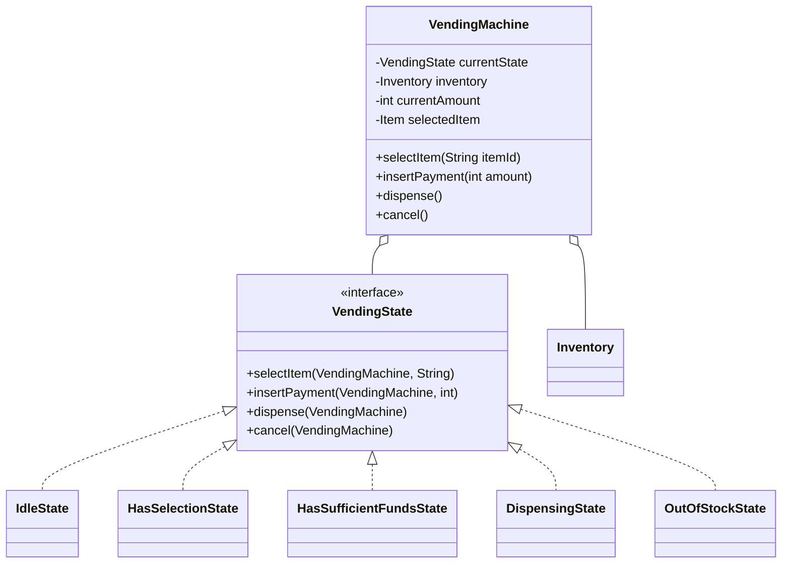
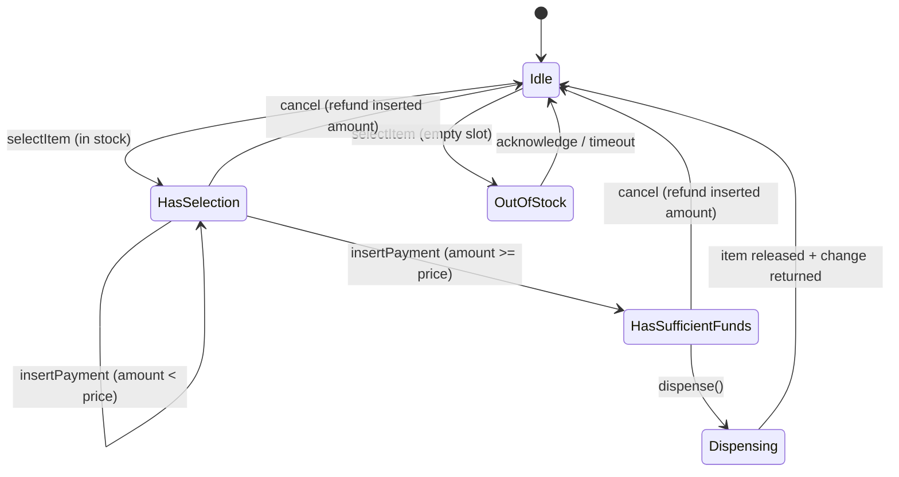

# Vending Machine — LLD

The **canonical State-pattern problem** in the "classic three" alongside
Parking Lot and Elevator System. It looks simple because the physical machine
is simple, but it's specifically chosen by interviewers because a vending
machine's behavior is *literally* a textbook finite state machine — select,
pay, dispense, change — and it's very easy to accidentally write a version that
lets an invalid transition happen (e.g. dispensing twice for one payment).

---

## Clarifying Questions to Ask First

- Does it need to **make change**, or is it exact-payment-only? (This decides
  whether the coin-change problem shows up as a real sub-problem.)
- What **payment methods** — coins/notes only, or also card/mobile? (Decides if
  Strategy is needed for payment, not just State for the machine.)
- Is this **one physical machine**, or are we also designing the **fleet-level
  inventory sync** for thousands of machines? (This is the pivot Amazon
  interviewers use to turn a "simple" problem into a distributed-systems
  follow-up.)
- Does the machine need an **admin/restock mode**?
- What happens on **cancel** mid-transaction, or a **power loss** mid-dispense?

Assume for this note: single physical machine, coins + notes, must make exact
change, has a restock/admin mode — the standard scope for this problem.

---

## Requirements

**Functional**
- Display available items and prices.
- Accept a **product selection**.
- Accept **payment** (multiple coins/notes over multiple insertions).
- **Dispense** the item once payment ≥ price, and return correct change.
- **Cancel** at any point before dispensing, returning inserted money.
- **Restock** and **read inventory** in admin mode.

**Non-Functional**
- The machine must never be in an ambiguous state — every input (select, insert
  coin, cancel, dispense) has exactly one valid response for the *current*
  state, and invalid inputs for that state are simply rejected/no-ops, never
  silently misinterpreted.
- Adding a new state (e.g. "out of order") or a new payment method must not
  require touching unrelated existing states.

---

## Core Objects (the Nouns)

```text
VendingMachine  -- the context; holds current State + Inventory
VendingState     -- interface: IdleState, HasSelectionState, HasSufficientFundsState,
                    DispensingState, OutOfStockState, MaintenanceState
Inventory        -- Map<Slot, Item + quantity>
Item             -- id, name, price
PaymentStrategy  -- CoinPayment, CardPayment (Strategy)
Coin/Note        -- denomination
```

---

## Class Diagram



### State Transition Diagram



**Why does `Idle` reject `insertPayment`?** Because inserting money before
selecting anything is a real-world edge case machines actually have to
handle — the correct behavior is state-dependent (many real machines just hold
a running balance before selection; others reject it). Naming this explicitly,
and picking one behavior deliberately, is exactly the kind of edge-case
thinking interviewers are listening for.

---

## Design Patterns Applied (Q&A)

**Q: Why State instead of a `status` enum with `if` checks scattered through one
big class?**

Because the number of *valid actions* differs sharply by state, and an enum +
`if` approach concentrates all of that branching into one method per action
(`selectItem` has an `if` for every possible current state, `insertPayment`
has its own `if` for every state, etc.) — every new state touches every
existing method. State flips this: each state class implements the full
interface, and *most* methods on *most* states are simply no-ops/rejections
("can't select while dispensing"). Adding `MaintenanceState` means writing one
new class that rejects everything except an admin unlock — zero edits to
`IdleState`, `HasSelectionState`, or any other existing class.

**Q: Where does Strategy fit, separately from State?**

Payment method. `insertPayment` conceptually doesn't care *how* value arrived —
coin, note, card swipe — it just needs a resulting amount credited. A
`PaymentStrategy` interface (`CoinPaymentStrategy`, `CardPaymentStrategy`) keeps
that concern orthogonal to the state machine: State governs *when* an action is
valid, Strategy governs *how* a valid action is actually carried out. Mixing
the two into one hierarchy (e.g. `CoinIdleState`, `CardIdleState`) would
combinatorially explode the number of state classes for no benefit.

---

## Core Code Skeleton (Java)

```java
public interface VendingState {
    default void selectItem(VendingMachine m, String itemId) { /* no-op: invalid in this state */ }
    default void insertPayment(VendingMachine m, int amount) { /* no-op */ }
    default void dispense(VendingMachine m) { /* no-op */ }
    default void cancel(VendingMachine m) { /* no-op */ }
}

public class IdleState implements VendingState {
    public void selectItem(VendingMachine m, String itemId) {
        Item item = m.getInventory().get(itemId);
        if (item == null || item.getQuantity() == 0) {
            m.setState(new OutOfStockState());
            return;
        }
        m.setSelectedItem(item);
        m.setState(new HasSelectionState());
    }
}

public class HasSelectionState implements VendingState {
    public void insertPayment(VendingMachine m, int amount) {
        m.addToBalance(amount);
        if (m.getBalance() >= m.getSelectedItem().getPrice()) {
            m.setState(new HasSufficientFundsState());
        }
        // else: stay in this state, balance carries over to the next insertPayment
    }
    public void cancel(VendingMachine m) {
        m.refund(m.getBalance());
        m.reset();
        m.setState(new IdleState());
    }
}

public class HasSufficientFundsState implements VendingState {
    public void dispense(VendingMachine m) {
        m.setState(new DispensingState()); // lock out further input immediately
        int change = m.getBalance() - m.getSelectedItem().getPrice();
        List<Coin> changeCoins = ChangeMaker.makeChange(change, m.getAvailableDenominations());
        if (changeCoins == null) { // exact change not possible with current float
            m.refund(m.getBalance());
            m.reset();
            m.setState(new IdleState());
            return;
        }
        m.getInventory().decrement(m.getSelectedItem());
        m.releaseItem(m.getSelectedItem());
        m.dispenseChange(changeCoins);
        m.reset();
        m.setState(new IdleState());
    }
    public void cancel(VendingMachine m) {
        m.refund(m.getBalance());
        m.reset();
        m.setState(new IdleState());
    }
}

public class VendingMachine {
    private VendingState currentState = new IdleState();
    private final Inventory inventory;
    private int balance;
    private Item selectedItem;

    public void selectItem(String itemId) { currentState.selectItem(this, itemId); }
    public void insertPayment(int amount) { currentState.insertPayment(this, amount); }
    public void dispense() { currentState.dispense(this); }
    public void cancel() { currentState.cancel(this); }
    // getters/setters/reset() omitted
}
```

**The change-making call is not incidental** — computing the minimum/correct
set of coins for a given amount from available denominations is exactly the
**coin-change problem already in this repo's DP folder**:
[`DP_04_Coin_Change_Min_Coins.md`](../../01_DynamicProgramming/DP_04_Coin_Change_Min_Coins.md)
for "fewest coins," and
[`DP_04_B_Coin_Change_Number_of_Ways.md`](../../01_DynamicProgramming/DP_04_B_Coin_Change_Number_of_Ways.md)
for "is it even possible with what's left in the machine." Naming this
connection out loud in an interview — "the change logic here is the same DP as
the classic coin-change problem, and it needs to run against the machine's
*actual remaining* denominations, not an infinite-supply assumption" — is a
strong, easy signal that ties your DSA and LLD prep together.

---

## Concurrency Deep Dive

**The honest answer first:** a single physical vending machine only has one
keypad/touchscreen, so only one human can be interacting with it at a time —
there's no "two customers pressing buttons on the same unit simultaneously" in
the way two cars can arrive at a Parking Lot at once. So don't over-engineer
locking into the state machine itself for that scenario.

**The real concurrency question is input serialization, not multi-user
contention:** a machine with both a touchscreen *and* a physical coin slot can
receive two near-simultaneous physical events (a coin drops in exactly as
`dispense()` is triggered from a lingering button state). The fix isn't a
elaborate locking scheme — it's the same idea as
[Redis's single-threaded command execution](../../HLD/redis_deep_dive.md#2-single-threaded-event-loop-architecture):
route every input (button press, coin sensor tick, card reader event) through
**one serialized event queue**, processed one at a time by the state machine.
This guarantees the state machine only ever sees one input in flight, so the
existing single-threaded `VendingState` methods above are already correct —
the concurrency-safety happens at the input layer, not inside the states.

**The interviewer's real pivot on this problem** is usually: *"now imagine
10,000 of these in a fleet, all reporting inventory to a central system."* That's
where genuine distributed-systems concurrency shows up — two independent
machines decrementing "5 units of Coke left" locally is fine (each unit is
physically isolated), but if inventory *replenishment orders* are computed
centrally from telemetry, that telemetry pipeline needs the same
at-least-once-delivery-plus-idempotent-processing pattern covered in
[`../../HLD/kafka_deep_dive.md#8-delivery-semantics`](../../HLD/kafka_deep_dive.md#8-delivery-semantics) —
naming that boundary explicitly (this part is LLD, that part is HLD) is exactly
the signal worth giving.

**One more real edge case worth naming:** power loss *during* `dispense()`,
after decrementing inventory but before the item physically drops. A real
design needs the decrement-and-release to be treated as a single recoverable
unit (e.g. don't decrement inventory until release is confirmed, or log the
in-flight transaction so a restart can detect and resolve it) — the same
crash-recovery idea as a database not considering a transaction durable until
it's fully committed.

---

## Common Follow-Up Questions

**Q: How do you handle "can't make exact change"?**
A: Check feasibility *before* committing to dispense — run the coin-change
feasibility check against the machine's current float, and if it fails, refuse
the sale and refund immediately rather than dispensing the item and getting
stuck unable to complete the transaction. This is why `dispense()` above
computes `changeCoins` and can still bail out to a refund.

**Q: How would you add card payment alongside coins?**
A: A `PaymentStrategy` interface, as discussed — `insertPayment` in each state
delegates to whichever strategy is active; no state class needs to know it's
coins vs. card.

**Q: How do you restock without taking the machine fully offline?**
A: A `MaintenanceState` that the states can transition into via an admin-only
action, rejecting all customer inputs while active — same additive pattern as
adding any other state.

**Q: What if the selected item goes out of stock *between* selection and
payment (someone else just bought the last one — relevant if this were
multi-user)?**
A: For a single physical machine this can't happen (see concurrency section);
if this is explicitly reframed as a shared/networked machine, this becomes a
check-then-act race identical to Parking Lot's spot-assignment race — same
fix, an atomic decrement-and-check on the inventory count rather than a
separate check followed by a separate decrement.

---

## Trade-offs Considered

| Decision | Benefit | Cost |
|---|---|---|
| State pattern over enum + branching | Each state's valid actions isolated; new states are additive | More classes than a single method with a switch |
| Strategy for payment method | Payment method and machine state vary independently | Extra interface/indirection for what could be one `if` in a small machine |
| Serialized input queue over per-action locking | Simple, matches physical reality (one user at a time) | Doesn't generalize directly if the machine ever needs true multi-input concurrency |
| Feasibility-check change before dispensing | Never dispenses an item it can't make change for | Slightly more upfront computation per sale |
| Decrement-on-confirmed-release, not on dispense-start | Survives power loss mid-dispense without losing inventory count | Requires tracking an in-flight transaction, not just fire-and-forget |

---

## Interview-Ready Summary

> I'd model this with a State pattern — Idle, HasSelection, HasSufficientFunds,
> Dispensing, OutOfStock — since the valid actions genuinely differ by state,
> and that keeps adding something like a maintenance mode additive rather than
> a rewrite. Payment method is a separate, orthogonal Strategy so coins vs.
> card doesn't multiply the number of state classes. Change-making reuses the
> same coin-change DP logic as the classic algorithms problem, checked for
> feasibility against the machine's actual remaining float *before* committing
> to a sale, so it never dispenses an item it can't make correct change for.
> Concurrency here isn't about multiple simultaneous users on one physical
> machine — it's about serializing the different physical input sources
> (keypad, coin sensor) through one queue so the state machine only ever
> processes one event at a time; the real distributed-systems question only
> shows up if this gets reframed as a fleet reporting to a central inventory
> system.

---

## Key Concepts to Master

```text
State pattern where valid actions genuinely differ per state (not just labels)
Strategy for a concern that's orthogonal to the state machine (payment method)
Reusing coin-change DP for a genuine sub-problem, checked for feasibility
  before committing to an action, not after
Serialized input queue as a simpler alternative to explicit locking when
  true concurrent access isn't physically possible
Crash-consistency: don't mutate durable state (inventory count) until the
  side effect it's paired with (physical release) is confirmed
Recognizing the LLD/HLD boundary when a "simple" prompt gets reframed as a
  fleet-scale/distributed problem
```
