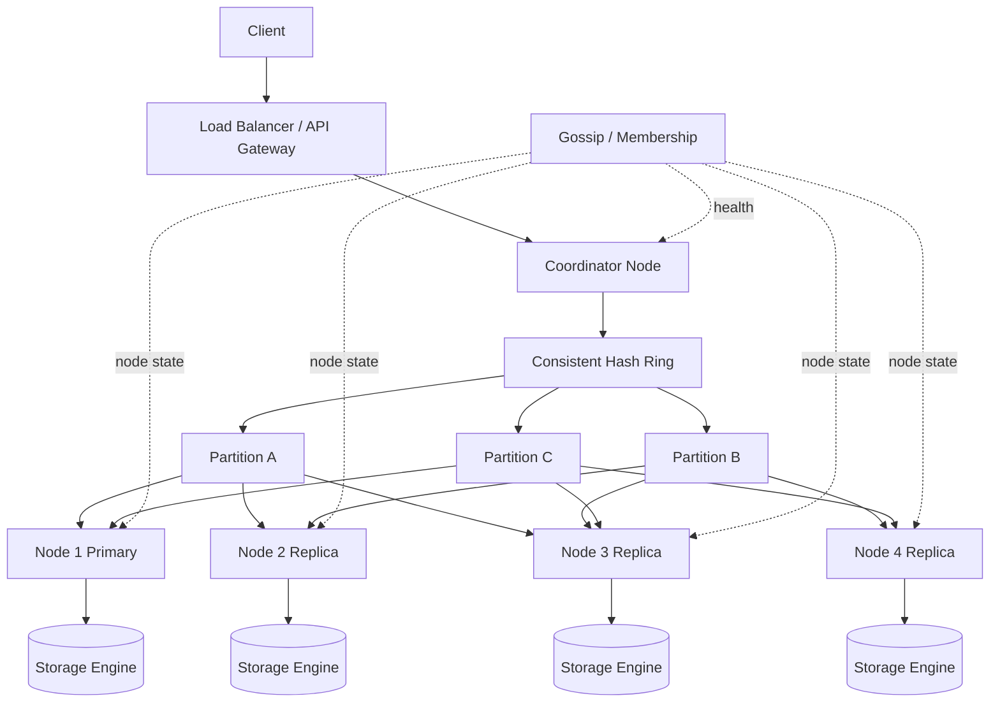

# Key-Value Store HLD

A key-value store stores data as a unique `key` mapped to an opaque `value`.
Examples: Redis, DynamoDB, Cassandra, RocksDB-backed services.

It is optimized for very fast lookups by key. Unlike a relational database, it usually does not support joins, complex queries, or rich relationships between entities.

## Functional Requirements

1. **Put key-value pair**
   - Store a value against a unique key.
   - If the key already exists, update/overwrite the old value.

2. **Get value by key**
   - Return the value for a given key.
   - Return `404 Not Found` or `null` if the key does not exist.

3. **Delete key**
   - Remove a key and its value from the store.

4. **Optional TTL**
   - Allow keys to expire automatically after a configured time.
   - Useful for cache, sessions, rate-limiting, temporary tokens.

5. **Optional versioning**
   - Store a version number or timestamp with each value.
   - Helps resolve concurrent writes and stale updates.

6. **Optional batch operations**
   - Support multi-get or batch-put for efficiency.

## Non Functional Requirements

1. **High availability**
   - The system should continue serving reads/writes even if some nodes fail.
   - Replication is required so data is not tied to a single machine.

2. **Low latency**
   - `GET` and `PUT` should usually complete in milliseconds.
   - In-memory cache, efficient hashing, and local disk storage help reduce latency.

3. **Scalability**
   - Support increasing data size and request traffic by adding more nodes.
   - Use horizontal scaling with partitioning/sharding.

4. **Fault tolerance**
   - Node failures should not cause data loss.
   - Failed nodes should be detected and replaced automatically.

5. **Durability**
   - Acknowledged writes should survive process restart or machine crash.
   - Use write-ahead log, commit log, or persistent storage engine.

6. **Consistency**
   - Many distributed key-value stores choose eventual consistency for availability.
   - Strong consistency is possible but may increase latency and reduce availability.

7. **Concurrency**
   - Multiple clients may read and write the same key at the same time.
   - Need conflict handling using timestamps, vector clocks, compare-and-swap, or last-write-wins.

8. **Observability**
   - Track latency, error rate, replication lag, disk usage, cache hit rate, and node health.

## API Design

### Put Value

```http
PUT /v1/kv/{key}
Content-Type: application/json
```

Request:

```json
{
  "value": "some-value",
  "ttlSeconds": 3600
}
```

Response:

```json
{
  "key": "user:123",
  "version": "1747851000-1",
  "status": "stored"
}
```

### Get Value

```http
GET /v1/kv/{key}
```

Response:

```json
{
  "key": "user:123",
  "value": "some-value",
  "version": "1747851000-1"
}
```

### Delete Value

```http
DELETE /v1/kv/{key}
```

Response:

```json
{
  "key": "user:123",
  "status": "deleted"
}
```

### Batch Get

```http
POST /v1/kv/batch-get
Content-Type: application/json
```

Request:

```json
{
  "keys": ["user:123", "user:456", "session:abc"]
}
```

Response:

```json
{
  "items": [
    {
      "key": "user:123",
      "value": "some-value",
      "version": "1747851000-1"
    }
  ],
  "missing": ["user:456", "session:abc"]
}
```

### Compare And Set

Used to avoid overwriting a value that changed after the client last read it.

```http
POST /v1/kv/{key}/cas
Content-Type: application/json
```

Request:

```json
{
  "expectedVersion": "1747851000-1",
  "newValue": "updated-value"
}
```

Response:

```json
{
  "key": "user:123",
  "version": "1747851042-1",
  "status": "updated"
}
```

## Data Model

Each record can be stored as:

```text
key -> {
  value,
  version,
  createdAt,
  updatedAt,
  expiresAt
}
```

Important constraints:

1. Key size should be bounded, for example `<= 1 KB`.
2. Value size should be bounded, for example `<= 1 MB`.
3. Keys are usually strings or bytes.
4. Values are opaque blobs. The key-value store does not understand the internal schema.

## High Level Components

1. **Client**
   - Sends `GET`, `PUT`, `DELETE`, or batch requests.

2. **API Gateway / Load Balancer**
   - Accepts traffic and forwards it to a healthy coordinator node.
   - Can handle auth, rate limits, and request validation.

3. **Coordinator Node**
   - Receives the request.
   - Finds the correct data nodes using consistent hashing.
   - Coordinates reads/writes across replicas.

4. **Partition / Shard**
   - A subset of keys stored on a group of nodes.
   - Example: keys whose hash falls in a specific hash range.

5. **Replica Nodes**
   - Store replicated copies of a partition.
   - Replication factor is commonly `3`.

6. **Storage Engine**
   - Stores data on disk or in memory.
   - Common options: LSM tree, B+ tree, append-only log, hash index.

7. **Membership / Gossip Service**
   - Tracks which nodes are alive.
   - Helps detect failures and spread cluster state.

8. **Monitoring System**
   - Tracks metrics, logs, alerts, and node health.

## Working

### 1. Key Partitioning

At scale, all data cannot live on a single machine. Keys are distributed across multiple nodes.

Simple hashing:

```text
nodeId = hash(key) % numberOfNodes
```

Problem with simple hashing:

When a node is added or removed, `numberOfNodes` changes. That causes many keys to be remapped, creating huge data movement.

Better approach:

Use **consistent hashing**.

1. Place physical nodes on a hash ring.
2. Hash each key onto the same ring.
3. Store the key on the first node found while moving clockwise.
4. When a node is added or removed, only nearby keys move.

Virtual nodes are often used so data is spread more evenly.

### 2. Write Flow

1. Client sends `PUT /v1/kv/{key}`.
2. Load balancer forwards request to a coordinator node.
3. Coordinator hashes the key and finds the responsible partition.
4. Coordinator finds replica nodes for that partition.
5. Coordinator writes to replicas.
6. Once the write quorum is reached, coordinator returns success.

Example quorum rule:

```text
replicationFactor = N = 3
writeQuorum = W = 2
readQuorum = R = 2

Strong-ish consistency condition: R + W > N
```

If `W = 2`, the write succeeds after 2 out of 3 replicas acknowledge it.

### 3. Read Flow

1. Client sends `GET /v1/kv/{key}`.
2. Coordinator hashes the key and finds responsible replicas.
3. Coordinator reads from `R` replicas.
4. If replicas return different versions, coordinator resolves the conflict.
5. Coordinator may repair stale replicas in the background.
6. Latest value is returned to the client.

### 4. Delete Flow

In distributed stores, delete is often implemented using a **tombstone**.

1. Client sends `DELETE /v1/kv/{key}`.
2. Coordinator writes a tombstone marker to replicas.
3. Reads treat tombstoned keys as deleted.
4. Background compaction later removes the old value and tombstone.

Tombstones prevent deleted data from coming back during replication repair.

### 5. TTL Expiration

For expiring keys:

1. Store `expiresAt` timestamp with the record.
2. On read, return missing if `expiresAt < now`.
3. Background cleanup removes expired keys.
4. Compaction can permanently remove expired records.

## Diagram



## Consistency Strategies

### Eventual Consistency

Writes may reach replicas at slightly different times. Reads may temporarily return stale data, but replicas eventually converge.

Useful when:

1. Availability is more important than strict freshness.
2. System must survive network partitions.
3. Very low latency is required.

### Strong Consistency

Every read returns the latest committed write.

Possible approaches:

1. Leader-based replication.
2. Consensus protocols like Raft or Paxos.
3. Quorum where `R + W > N`.

Tradeoff:

Strong consistency usually increases latency and can reduce availability during failures.

## Replication

Replication copies data across multiple nodes.

Example:

```text
replicationFactor = 3
key user:123 is stored on Node 1, Node 2, and Node 3
```

Benefits:

1. Higher availability.
2. Better fault tolerance.
3. Reads can be served from multiple replicas.

Common replication models:

1. **Leader-follower**
   - Writes go to leader.
   - Leader replicates to followers.
   - Simpler conflict handling.

2. **Leaderless**
   - Any coordinator can write to multiple replicas.
   - Uses quorum and conflict resolution.
   - More available, but conflict handling is harder.

## Conflict Resolution

Conflicts happen when multiple clients update the same key concurrently.

Common approaches:

1. **Last write wins**
   - Keep the value with the latest timestamp.
   - Simple, but can lose updates.

2. **Version number**
   - Each update increments a version.
   - Client can use compare-and-set to avoid stale writes.

3. **Vector clock**
   - Tracks causality between updates.
   - Can detect conflicting writes.
   - More complex, but useful in leaderless systems.

4. **Application-level merge**
   - Return conflicting versions to the client or application.
   - Application decides how to merge.

## Storage Engine Options

### In-Memory Hash Map

Used by cache-like systems.

Pros:

1. Extremely fast.
2. Simple lookup.

Cons:

1. Expensive for very large datasets.
2. Needs persistence strategy for durability.

### Append-Only Log

Each write is appended to a file.

Pros:

1. Fast sequential writes.
2. Easy crash recovery.

Cons:

1. Needs compaction to remove old versions and deleted keys.

### LSM Tree

Common for write-heavy systems.

How it works:

1. Write goes to memory table and write-ahead log.
2. Memory table is flushed to disk as immutable sorted files.
3. Background compaction merges files and removes old values.

Pros:

1. High write throughput.
2. Efficient range of storage sizes.

Cons:

1. Reads may check multiple files.
2. Compaction can consume CPU and disk I/O.

## Failure Handling

1. **Node failure**
   - Failure is detected using heartbeat timeout or gossip membership updates.
   - Coordinator stops sending requests to the failed node.
   - Reads are served from healthy replicas.
   - Writes are sent to remaining replicas.
   - If quorum is still possible, request succeeds.
   - If quorum is not possible, request fails or is accepted with weaker consistency depending on system design.
   - A temporary node can store missed writes as **hints** for the failed node. This is called hinted handoff.
   - When the failed node comes back, it receives missed writes from hinted handoff.
   - Background repair or anti-entropy sync fixes any remaining stale data.
   - If the node is permanently lost, a replacement node is added and data is rebuilt from replicas.

2. **Network partition**
   - Depending on consistency choice, either continue serving with possible stale reads or reject some requests.
   - In AP-style systems, both sides may accept writes and resolve conflicts later.
   - In CP-style systems, the minority partition usually rejects writes to preserve consistency.

3. **Disk failure**
   - Replace node and rebuild data from replicas.
   - If only one disk/segment is corrupted, recover healthy data from other replicas.
   - Use checksums to detect corrupted data blocks.

4. **Coordinator failure**
   - Client retries through load balancer.
   - Another coordinator handles the request.

5. **Replica lag**
   - Use read repair, anti-entropy repair, or background synchronization.

### Node Failure Handling Strategy

Detailed strategy:

1. **Detect failure**
   - Every node sends heartbeats or participates in gossip.
   - If a node misses heartbeats for a threshold period, mark it as `suspect`.
   - If it remains unreachable, mark it as `down`.

2. **Route around failure**
   - Coordinators update their routing table.
   - Requests are sent only to healthy replicas.
   - Load balancer also removes unhealthy nodes from rotation.

3. **Maintain availability**
   - If `N = 3`, `W = 2`, and one node is down, writes can still succeed on the remaining two replicas.
   - If two replicas are down, quorum is not possible. The system can either reject writes or accept them with lower consistency.

4. **Store missed writes**
   - If Node 3 is down, Node 1 or another healthy node stores a hint like:

```text
hint = {
  targetNode: "Node 3",
  key: "user:123",
  value: "...",
  version: "v42"
}
```

5. **Recover node**
   - When Node 3 comes back, hinted writes are replayed to it.
   - Merkle tree or checksum comparison can identify missing/stale key ranges.
   - Background repair syncs only the differences.

6. **Replace node if needed**
   - If Node 3 is permanently dead, add a new node.
   - Consistent hashing assigns its token ranges.
   - Neighboring replicas stream data to the new node.
   - After rebuild completes, the new node becomes active.

## Edge Cases And Handling Strategies

### 1. Hot Key Problem

A hot key is a key that receives much more traffic than other keys.

Example:

```text
GET product:iphone-launch
GET celebrity:profile:123
GET leaderboard:global
```

Problem:

Even if the whole cluster is large, one hot key may always map to the same partition or replica group. This can overload a small number of nodes.

Handling strategies:

1. **Client-side or CDN caching**
   - Cache very popular read-only values near the client.
   - Useful for public or mostly static data.

2. **Application-level cache**
   - Keep hot values in Redis/memory before hitting the storage layer.
   - Use short TTL to reduce staleness.

3. **Replica reads**
   - Serve reads from multiple replicas instead of only the primary.
   - Works best for read-heavy hot keys.

4. **Increase replication for hot keys**
   - Dynamically replicate hot keys to more nodes.
   - Coordinator can fan out reads across more copies.

5. **Key splitting / salting**
   - Split one logical hot key into multiple physical keys.

```text
counter:video:123:shard:1
counter:video:123:shard:2
counter:video:123:shard:3
```

   - Reads aggregate values from all shards.
   - Useful for hot counters and write-heavy keys.

6. **Rate limiting**
   - Protect the cluster from abusive clients or accidental request storms.

7. **Request coalescing**
   - If many requests ask for the same missing/stale key, only one backend request is sent.
   - Other requests wait for the first result.

### 2. Large Value Problem

Problem:

Very large values increase network cost, memory pressure, disk I/O, and replication delay.

Handling strategies:

1. Reject values above a configured size limit.
2. Store large objects in object storage and keep only the object reference in the key-value store.
3. Compress values if CPU cost is acceptable.
4. Split large values into chunks only when the application can handle chunk management.

### 3. Hot Partition Problem

Problem:

Even if individual keys are not hot, many active keys may fall into the same partition.

Handling strategies:

1. Use virtual nodes with consistent hashing.
2. Rebalance partitions when traffic is uneven.
3. Split overloaded partitions.
4. Move hot token ranges to less loaded nodes.

### 4. Cache Stampede

Problem:

A popular cached key expires and many clients hit the storage layer at the same time.

Handling strategies:

1. Add random TTL jitter so keys do not expire together.
2. Use request coalescing.
3. Refresh hot keys before expiry.
4. Serve slightly stale data while refreshing in the background.

### 5. Thundering Herd After Node Recovery

Problem:

When a failed node comes back, too much repair traffic can overload the cluster.

Handling strategies:

1. Throttle repair traffic.
2. Rebuild data gradually by token range.
3. Prioritize recent writes first.
4. Keep serving user traffic from healthy replicas during rebuild.

### 6. Clock Skew

Problem:

If conflict resolution depends only on timestamps, machines with different clocks may pick the wrong winner.

Handling strategies:

1. Prefer logical versions or vector clocks where correctness matters.
2. Use NTP to reduce clock drift.
3. Avoid pure last-write-wins for critical data.

### 7. Delete Reappearing

Problem:

A deleted value can reappear if an old replica missed the delete and later participates in repair.

Handling strategies:

1. Use tombstones for deletes.
2. Keep tombstones long enough for all replicas to see them.
3. Remove tombstones only after compaction and repair safety windows.

### 8. Uneven Data Size

Problem:

Some keys may store much larger values than others, causing storage imbalance even if key count is balanced.

Handling strategies:

1. Track partition size, not only key count.
2. Rebalance based on disk usage and request rate.
3. Enforce value size limits.
4. Move large-key ranges to less loaded nodes.

## Capacity Estimation Example

Assume:

```text
100 million keys
average key size = 100 bytes
average value size = 1 KB
metadata per record = 100 bytes
replication factor = 3
```

Raw data:

```text
100M * (100 B + 1 KB + 100 B)
= 100M * 1224 B
= 122.4 GB
```

With replication:

```text
122.4 GB * 3 = 367.2 GB
```

Add extra space for logs, indexes, compaction, and backups. A practical estimate may be `2x` more than replicated data.

```text
367.2 GB * 2 = 734.4 GB
```

## Interview Design Summary

1. Start with API: `PUT`, `GET`, `DELETE`, optional `TTL`, optional batch operations.
2. Partition data using consistent hashing.
3. Replicate each partition to multiple nodes.
4. Use quorum reads/writes depending on consistency requirements.
5. Use write-ahead log or append-only log for durability.
6. Use tombstones for deletes.
7. Use read repair and background anti-entropy to fix stale replicas.
8. Handle node failures with heartbeats, gossip, hinted handoff, and replica rebuild.
9. Mitigate hot keys using caching, replica reads, dynamic replication, key splitting, and rate limiting.
10. Monitor latency, errors, disk, replication lag, hot keys, and node health.

## Tradeoffs

| Decision | Benefit | Cost |
| --- | --- | --- |
| Eventual consistency | High availability and low latency | Stale reads possible |
| Strong consistency | Fresh reads | Higher latency and lower availability during failures |
| Consistent hashing | Less data movement on scaling | More complex routing |
| Replication | Fault tolerance | More storage and replication lag |
| Tombstones | Safe distributed delete | Requires compaction |
| LSM tree | High write throughput | Read amplification and compaction cost |
| Hot key caching | Reduces load on storage nodes | Can return stale data |
| Key splitting | Spreads write load | Reads need aggregation |
| Hinted handoff | Helps failed nodes catch up | Temporary hint storage can grow |
